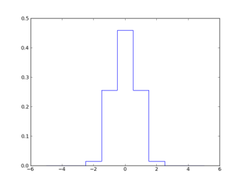

Python interface for MUSE PSF models
************************************

LSF models
==========

Simple LSF model
----------------

This is a simple model where the LSF is supposed to be constant over the filed of view. It uses a simple parametric model of variation with wavelength.
    
The model is a convolution of a step function with a gaussian. The resulting function is then sample by the pixel size.

  LSF = T(y2+dy/2) - T(y2-dy/2) - T(y1+dy/2) + T(y1-dy/2)
  
  T(x) = exp(-x**2/2) + sqrt(2*pi)*x*erf(x/sqrt(2))/2
  
  y1 = (y-h/2) / sigma
  
  y2 = (y+h/2) / sigma
  

The slit width is assumed to be constant (h = 2.09 pixels).

The gaussian sigma parameter is a polynomial approximation of order 3 with wavelength:

  c = [-0.09876662, 0.44410609, -0.03166038, 0.46285363]
  
  sigma(x) = c[3] + c[2]*x + c[1]*x**2 + c[0]*x**3

Tutorial
========

  >>> from mpdaf.MUSE import LSF
  
  >>> LSF(lbda=6000,step=1.25,size=11)
  array([  1.35563937e-15,   1.29241981e-09,   2.87088720e-05,
         1.45978758e-02,   2.55903993e-01,   4.58938842e-01,
         2.55903993e-01,   1.45978758e-02,   2.87088720e-05,
         1.29241998e-09,   1.69454922e-15])

  >>> import matplotlib.pyplot as plt
  >>> import numpy as np
  >>> plt.plot(np.arange(-5,6),LSF(lbda=6000,step=1.25,size=11),drawstyle='steps-mid')
  >>> plt.show()
  

References
==========

:func:`mpdaf.MUSE.LSF <mpdaf.MUSE.LSF>` returns a MUSE LSF according to the simple model.

