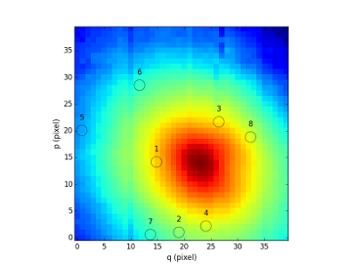

Catalog object
**************

Catalog is a subclass of Table class from astropy.table.

A catalog object can be read from a file (by using the astropy.table constructor Table.read) or it can be created from a list of :class:`mpdaf.sdetect.Source` objects.

Examples
========

Preliminary import::

 >>> from mpdaf.sdetect import Catalog
 
First, we create our catalog from a list of sources::

 # sources is the output of a detection code (focus or muselet or sea or selfi)
 >>> cat = cat = Catalog.from_sources(sources)
 >>> print cat
  ID     RA        DEC      ORIGIN ORIGIN_V ...    MUSEG_ERR         MUSER        MUSER_ERR        Z_EMI      Z_EMI_ERR  
 --- --------- ----------- ------- -------- ... ---------------- ------------- ---------------- ------------ ------------
   2 3.5865855 -30.3994770 muselet      2.0 ... 0.00350000010803 18.2817993164 0.00359999993816     0.960000     0.000490
   3 3.5862715 -30.4002743 muselet      2.0 ... 0.00170000002254 17.0042991638 0.00159999995958     0.960000     0.000483
   4 3.5877233 -30.3996830 muselet      2.0 ...  0.0980999991298 21.8239994049  0.0645999982953 -9999.000000 -9999.000000
   5 3.5902069 -30.4005165 muselet      2.0 ...  0.0054999999702 18.6847991943 0.00430000014603     0.497000     0.000303
   6 3.5879827 -30.4009571 muselet      2.0 ... 0.00400000018999 18.5907001495  0.0038999998942     0.960000     0.000441
   8 3.5888603 -30.4017448 muselet      2.0 ...  0.0412000007927 21.3047008514  0.0397000014782     0.749000     0.000555
   9 3.5899041 -30.4018631 muselet      2.0 ...  0.0749000012875  22.345199585  0.0991000011563     0.498000     0.000251
  10 3.5899093 -30.3976822 muselet      2.0 ...  0.0560000017285 21.8227005005   0.075900003314     0.474000     0.000140
  12 3.5876021 -30.3965073 muselet      2.0 ... 0.00179999996908 17.6004009247 0.00170000002254     0.960000     0.000587
  14 3.5887122 -30.3964310 muselet      2.0 ...  0.0170000009239 20.1849002838   0.016799999401     0.960000     0.000497
  16 3.5883856 -30.3984413 muselet      2.0 ... 0.00279999990016 18.1133003235 0.00260000000708     0.960000     0.000403
  17 3.5888007 -30.3998241 muselet      2.0 ...   0.089500002563 22.0856990814  0.0878000035882 -9999.000000 -9999.000000
  18 3.5842493 -30.3993587 muselet      2.0 ...  0.0215000007302 20.1117992401  0.0237000007182 -9999.000000 -9999.000000
  20 3.5868824 -30.3983326 muselet      2.0 ...   0.192200005054 22.7674999237   0.163299992681 -9999.000000 -9999.000000
  23 3.5846601 -30.3961506 muselet      2.0 ...   0.311300009489  23.591999054   0.302799999714 -9999.000000 -9999.000000
  24 3.5855227 -30.3972149 muselet      2.0 ...  0.0113000003621 19.6224002838  0.0100999996066     0.960000     0.000473
  
Then, we visualize these sources on our white image::

 >>> from mpdaf.obj import Image
 >>> ima = Image('white.fits')
 >>> fig = plt.figure()
 >>> ax = fig.add_subplot(1,1,1)
 >>> ima.plot(scale='log')
 >>> cat.plot_id(ax, ima.wcs)
 

 

Reference
=========

:func:`mpdaf.sdetect.Catalog.from_sources <mpdaf.sdetect.Catalog.from_sources>` constructs a catalog from a list of source objects.

:func:`mpdaf.sdetect.Catalog.match <mpdaf.sdetect.Catalog.match>` matchs elements of the current catalog with an other (in RA, DEC).

:func:`mpdaf.sdetect.Catalog.plot_symb <mpdaf.sdetect.Catalog.plot_symb>` plots the sources location from the catalog.

:func:`mpdaf.sdetect.Catalog.plot_id <mpdaf.sdetect.Catalog.plot_id>` displays the id of the catalog.
