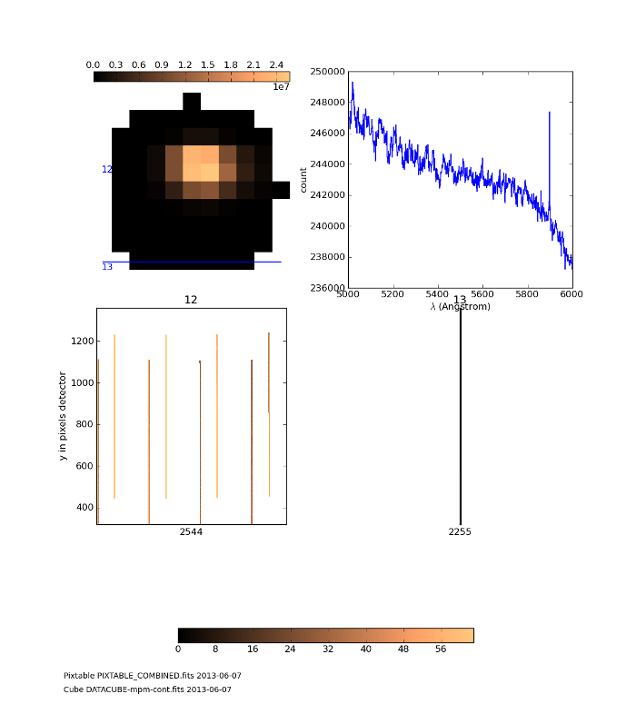

 
Visualize a pixel table and the corresponding cube
**************************************************

The objective is to visualize both the reconstructed cube and the pixel detectors (via the pixel table) to check the quality of a merged data cube.

For example the user has identified a faint emission line but which may be a cosmic residual or a strange structure in the reconstructed image at a specific location. This tool lets the user to check that it is not due to a problem in a specific exposure which have been used in the merging.

This tool accepts as input a cube and a pixtable. The user specifies a sub-region and a wavelength range. This tool first plots the white image and spectrum correspondig to the sub-region. Moreover, it searchs in the pixtable the pixels that were used in the merging and builds and displays the corresponding list of sub raw images. Each sub image displays the pixels used and the pixels not used are masked.

Format
======

DisplayPixelTable class with the following attributes:

+----------+--------+-----------------------------------------+
| Array    | Type   | Description                             |
+==========+========+=========================================+
| pixtable | string | The FITS file name of MUSE pixel table. |
+----------+--------+-----------------------------------------+
| cube     | string | The FITS file name of MUSE cube.        |
+----------+--------+-----------------------------------------+

Tutorials
=========

Preliminary imports for all tutorials::

  >>> from mpdaf.drs import DisplayPixTable
  >>> import matplotlib.pylab as plt
  

Tutorial 1
----------

In this tutorial we will learn how to visualize a cube and the corresponding pixels on the detector.
We read the pixtable and the cube from the disk and check their basic informations and FITS header content::

 >>> dis = DisplayPixTable(pixtable = 'PIXTABLE_COMBINED.fits',cube ='DATACUBE-mpm-cont.fits')
 >>> dis.info()
 4438 X 37 X 306 cube (DATACUBE-mpm-cont.fits)
 .data(4438,37,306) (count) fscale=1, .var(4438,37,306)
 spatial coord: min:(-12.1,-152.5) max:(23.9,152.5) step:(1.0,1.0) rot:0.0
 wavelength: min:4198.51 max:9744.76 step:1.25 Angstrom
 .ima:  WHITE 

 3 merged IFUs went into this pixel table
 Filename: PIXTABLE_COMBINED.fits
 No.    Name         Type      Cards   Dimensions   Format
 0    PRIMARY     PrimaryHDU     961   ()           uint8   
 1                BinTableHDU     27   45270485R x 7C   [1E, 1E, 1E, 1E, 1J, 1E, 1J]   

Now we select a circular region of the pixtable centered around an object and we will restrict
the wavelength to the 5000:6000 Angstroem range. The following command displays the reconstructed images on the detectors (one per channel):: 

 >>> dis.det_display(lbda=(5000,6000),sky=(4,30,5,'C'))
 extract sub-pixel table ...
 plot detector image of the CHAN12 ...
 plot detector image of the CHAN13 ...
 plot corresponding white image ...
 plot corresponding spectrum ... 

Note that we have extracted a circular ('C') region of 5 pixels around the object.

It is possible to change the parameters of the visualization. For example, we can display the white image on the sky in log scale and we can use a grey color map for the detector images::

 >>> import matplotlib.cm as cm
 >>> dis.det_display(lbda=(5000,6000),sky=(4,30,5,'C'),sky_scale='log', det_cmap=cm.Greys)
 extract sub-pixel table ...
 plot detector image of the CHAN12 ...
 plot detector image of the CHAN13 ...
 plot corresponding white image ...
 plot corresponding spectrum ...

.. figure::  user_manual_pixtable_images/display2.png
   :align:   center

The method slice_display displays the dectector pixels, slice per slice::

 >>> dis.slice_display(lbda=(5000,6000),sky=(4,30,10,'C'))
 extract sub-pixel table ...
 plot corresponding white image ...
 plot corresponding spectrum ...
 plot slice image ifu=12 slice=26 ...
 plot slice image ifu=12 slice=29 ...
 plot slice image ifu=12 slice=25 ...
 plot slice image ifu=12 slice=32 ...
 plot slice image ifu=12 slice=28 ...
 plot slice image ifu=12 slice=35 ...
 plot slice image ifu=12 slice=31 ...
 plot slice image ifu=12 slice=36 ...
 plot slice image ifu=12 slice=34 ...
 plot slice image ifu=12 slice=33 ...
 plot slice image ifu=13 slice=27 ...
 plot slice image ifu=12 slice=30 ...
 plot slice image ifu=13 slice=30 ...
 plot slice image ifu=12 slice=27 ...
 plot slice image ifu=13 slice=33 ...
 plot slice image ifu=11 slice=34 ...
 plot slice image ifu=13 slice=36 ...
 plot slice image ifu=11 slice=31 ...
 plot slice image ifu=13 slice=35 ...
 plot slice image ifu=13 slice=32 ...
 
.. figure::  user_manual_pixtable_images/display4.png
   :align:   center

Reference
=========

:func:`mpdaf.drs.DisplayPixTable.info <mpdaf.drs.DisplayPixTable.info>` gives info about the cube and the pixel table.

:func:`mpdaf.drs.DisplayPixTable.det_display <mpdaf.drs.DisplayPixTable.det_display>` displays pixtable in detector mode.

:func:`mpdaf.drs.DisplayPixTable.slice_display <mpdaf.drs.DisplayPixTable.slice_display>` displays pixtable in slice mode.