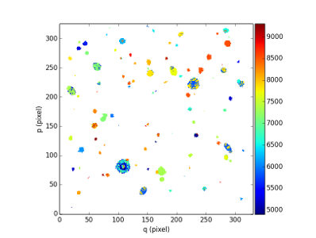

Fast Object Cube Search: FOCUS
******************************

This software is developed by Carole Clastre (MUSICOS PhD) under the supervision of David Mary (Lagrange insitute, University of Nice).
Please contact Carole for more info at carole.clastres@univ-lyon1.fr

For now it proposes to detect quickly bright voxels by computing false alarms with the Student approximation.

See also `A quick voxel-based detection method for MUSE - Application to the HDFS data cube. <http://urania1.univ-lyon1.fr/mpdaf/attachment/wiki/WikiCoreLib/Quick.pdf>`_

FOCUS object format
===================

A FOCUS object O consist of:

+------------+---------------------------------------+
| Component  | Description                           |
+============+=======================================+
| O.cube     | Cube object (:class:`mpdaf.obj.Cube`) |
+------------+---------------------------------------+
| O.expmap   | Exposures map FITS file name.         |
+------------+---------------------------------------+

Examples
========

Preliminary import::

 >>> from mpdaf.sdetect import FOCUS

We will test the source detection on the HDFS cube::
 
 >>> detect = FOCUS(cube='DATACUBE-HDFS.fits', expmap='EXPMAP-HDFS.fits')

First, we compute the corresponding false detection probability cube using the data, variance and nb of exposures.  
The Student cumulative distribution function with expmap-1 degrees of freedom is used.
(note that this first step can take up to 15 mn for a standard size MUSE data cube)::

 >>> pval = detect.p_values()
 [INFO] FOCUS - Compute weighted cube
 [INFO] FOCUS - Computing the p-values using student cumulative distribution function with expmap-1 degrees of freedom
 [INFO] FOCUS - Please note that it takes some time ...
 
:func:`p_values <mpdaf.sdetect.FOCUS.p_values>` method returns a :class:`mpdaf.obj.Cube` object. Each voxel of the cube contain the false detection probability (p-values). We save it as a FITS file::

 >>> pval.write('pval.fits')
 
Then, we use these p_values to detects voxels with P < 1.e-8 and connect them into objects::

 >>> ima, sources = detect.quick_detection(pval, 1.e-8)
 [INFO] FOCUS - Computing weighted cube
 [INFO] FOCUS - Filtering to remove deviant pixels
 [INFO] FOCUS - Detecting where p-values<1e-08
 [INFO] FOCUS - Finding the 8 connected components
 [INFO] FOCUS - 123 objects detected

 
:func:`quick_detection <mpdaf.sdetect.FOCUS.quick_detection>` return an :class:`mpdaf.obj.Image` object and a :class:`mpdaf.sdetect.SourceList` object.

The image is used to display the location of the detected objects and the wavelength of the peak intensity of the object spectra::

 >>> ima.plot(vmin=4900, vmax=9300, colorbar='v')
 

A :class:`mpdaf.sdetect.Catalog` object can be built from the list of sources::

 >>> from mpdaf.sdetect import Catalog
 >>> cat = Catalog.from_sources(sources)
 
We print the coordinates of the detected components and the wavelengths of the third first intensity peaks::

 >>> print cat['ID', 'RA', 'DEC', 'LBDA_OBS001', 'LBDA_OBS002', 'LBDA_OBS003']
 ID      RA         DEC     LBDA_OBS001 LBDA_OBS002 LBDA_OBS003
 --- ----------- ----------- ----------- ----------- -----------
   1 338.2434998 -60.5720940     8565.00     9208.75         nan
   2 338.2266541 -60.5720406     7802.50     9191.25         nan
   3 338.2361145 -60.5719376     8302.50     8347.50     9012.50
   4 338.2243347 -60.5719566     7866.25     7968.75     9006.25
 ...         ...         ...         ...         ...         ...
 120 338.2285767 -60.5548859     4778.75     5402.50         nan
 121 338.2205505 -60.5548782     5243.75     6676.25     7550.00
 122 338.2329102 -60.5548515     5002.50     7386.25         nan
 123 338.2201538 -60.5548325     4826.25     4837.50     4947.50
 Length = 123 rows
 
We could save the catalog in a fits file or an ascii file::

 >>> cat.write('cat.fits')
 >>> cat.write('cat.txt', format='ascii')
 
The method :func:`SourceList.write <mpdaf.sdetect.SourceList.write>` can also be used to saved each source object as a fits file in a given directory (for example labelled 'FocusSources')::

 >>> sources.write('FocusSources')
 >>> ls FocusSources
 FocusSources-0001.fits  FocusSources-0009.fits  FocusSources-0017.fits  FocusSources-0025.fits  FocusSources-0033.fits  FocusSources-0041.fits
 FocusSources-0002.fits  FocusSources-0010.fits  FocusSources-0018.fits  FocusSources-0026.fits  FocusSources-0034.fits  FocusSources-0042.fits
 ...

Reference
=========

:func:`mpdaf.sdetect.FOCUS <mpdaf.sdetect.FOCUS>` is the classic constructor.

:func:`mpdaf.sdetect.FOCUS.p_values <mpdaf.sdetect.FOCUS.p_values>` computes the false detection cube using Student cumulative distribution function.

:func:`mpdaf.sdetect.FOCUS.quick_detection <mpdaf.sdetect.FOCUS.quick_detection>` makes a fast detection of bright voxels and builds a catalog of objects.
