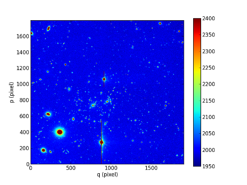
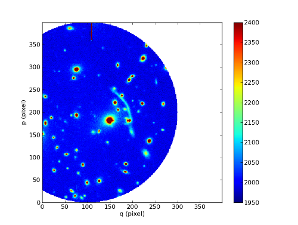
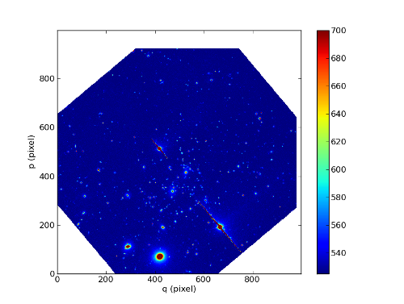
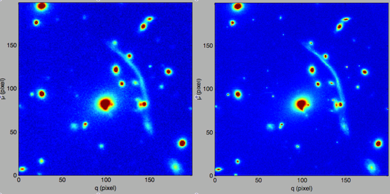
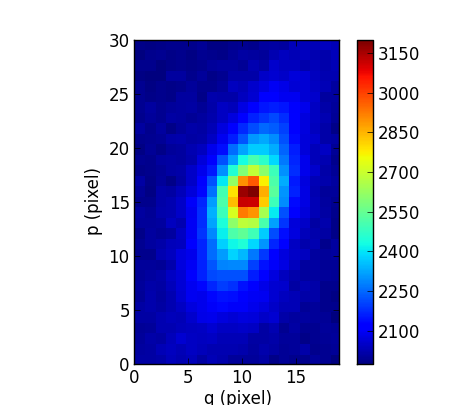
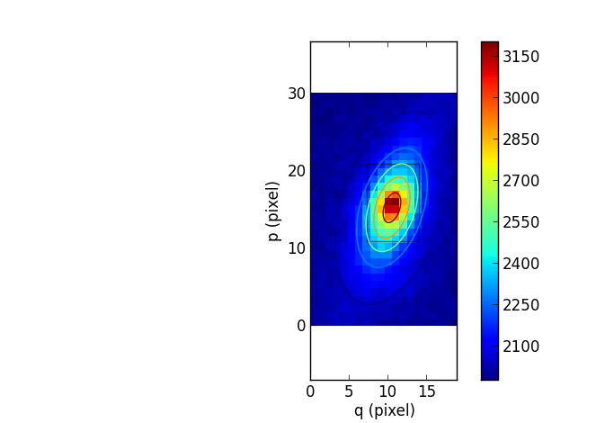
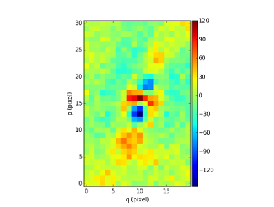
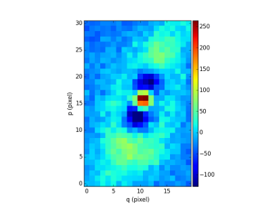

Image object
************

Image, optionally including a variance and a bad pixel mask.
The Image object handles a 2D data array (basically a numpy masked array) containing flux values, associated with a :class:`WCS <mpdaf.obj.WCS>`
object containing the spatial coordinated information (alpha,delta). Optionally, a variance data array
can be attached and used for weighting the flux values. Array masking is used to ignore
some of the pixel values in the calculations.

Note that virtually all numpy and scipy functions are available.

Examples
========

::

  import numpy as np
  from mpdaf.obj import Image
  from mpdaf.obj import WCS

  wcs1 = WCS(crval=0,cdelt=0.2)
  wcs2 = WCS(crval=0,cdelt=0.2,shape=400)
  MyData = np.ones((300,300))

  ima = Image(filename="image.fits",ext=1) # image from file without variance (extension number is 1)
  ima = Image(filename="image.fits",ext=(1,2)) # image from file with variance (extension numbers are 1 and 2)
  ima = Image(data=MyData, wcs=wcs1) # image 300x300 filled with MyData
  ima = Image(data=MyData, wcs=wcs2) # warning: world coordinates and data have not the same dimensions.
  # Shape of WCS object is modified.
  # ima.wcs.naxis1 = 300
  # ima.wcs.naxis2 = 300

Functions to create a new image
-------------------------------

Examples::

    import numpy as np
    from mpdaf.obj import gauss_image
    from mpdaf.obj import WCS
    wcs = WCS (cdelt=(0.2,0.3), crval=(8.5,12),shape=(40,30))
    ima = gauss_image(wcs=wcs, width=(1,2), factor=2, rot=60)
    ima.plot()
    gauss = ima.gauss_fit(pos_min=(4, 7), pos_max=(13,17), cont=0, plot=True)
    gauss.print_param()

Examples::

  import numpy as np
  from mpdaf.obj import Image
  from mpdaf.obj import composite_image

  stars = Image(filename="stars.fits")
  lowz = Image(filename="lowz.fits")
  highz = Image(filename="highz.fits")
  imalist = [stars, lowz, highz]
  tab = zip(imalist, linspace(250,0,3), ones(3)*100)
  p1 = composite_image(tab, cuts=(0,99.5), mode='sqrt')
  p1.show()
  p1.save('test_composite.jpg')

Image object format
===================

An Image object O consists of:

+------------------+----------------------------------------------------------------------------+
| Component        | Description                                                                |
+==================+============================================================================+
| O.filename       | Possible FITS filename                                                     |
+------------------+----------------------------------------------------------------------------+
| O.primary_header | FITS primary header instance                                               |
+------------------+----------------------------------------------------------------------------+
| O.wcs            | World coordinate spatial information (:class:`WCS <mpdaf.obj.WCS>` object) |
+------------------+----------------------------------------------------------------------------+
| O.shape          | Array containing the 2 dimensions [np,nq] of the image                     |
+------------------+----------------------------------------------------------------------------+
| O.data           | Masked numpy array with data values                                        |
+------------------+----------------------------------------------------------------------------+
| O.data_header    | FITS data header instance                                                  |
+------------------+----------------------------------------------------------------------------+
| O.unit           | Physical units of the data values                                          |
+------------------+----------------------------------------------------------------------------+
| O.dtype          | Type of the data (integer, float)                                          |
+------------------+----------------------------------------------------------------------------+
| O.var            | (optionally) Numpy array with variance values                              |
+------------------+----------------------------------------------------------------------------+

The format of each numpy array follows the indexing used by Python to
handle images. For an MPDAF image im, the pixel in the lower-left corner is
referenced as im[0,0] and the pixel im[p,q] refers to the horizontal position
q and the vertical position p, as follows:

.. figure:: _static/image/grid.jpg
  :align: center

In total, this image im contains nq pixels in the horizontal direction and
np pixels in the vertical direction.

Reference
=========

:func:`mpdaf.obj.Image.copy <mpdaf.obj.DataArray.copy>` returns a new copy of an Image object.

:func:`mpdaf.obj.Image.clone <mpdaf.obj.DataArray.clone>` returns a new image of the same shape and coordinates, filled with zeros.

:func:`mpdaf.obj.Image.write <mpdaf.obj.Image.write>` saves Image object in a FITS file.

:func:`mpdaf.obj.Image.info <mpdaf.obj.DataArray.info>` prints information.

:func:`mpdaf.obj.Image.inside <mpdaf.obj.Image.inside>` returns True if coord is inside image.

:func:`mpdaf.obj.Image.background <mpdaf.obj.Image.background>` computes the image background.

:func:`mpdaf.obj.Image.peak <mpdaf.obj.Image.peak>` locates a peak in a sub-image.

:func:`mpdaf.obj.Image.peak_detection <mpdaf.obj.Image.peak_detection>` returns a list of peak locations.

Indexing
--------

:func:`Image[p,q] <mpdaf.obj.Image.__getitem__>` returns the value of pixel (p,q).

:func:`Image[p1:p2,q1:q2] <mpdaf.obj.Image.__getitem__>` returns a sub-image.

:func:`Image[p,q] = value <mpdaf.obj.Image.__setitem__>` sets value in Image.data[p,q].

:func:`Image[p1:p2,q1:q2] = array <mpdaf.obj.Image.__setitem__>` sets the corresponding part of Image.data.

Getters and setters
-------------------

:func:`mpdaf.obj.Image.get_step <mpdaf.obj.Image.get_step>` returns the image steps [dy,dx].

:func:`mpdaf.obj.Image.get_range <mpdaf.obj.Image.get_range>` returns [ [y_min,x_min], [y_max,x_max] ]

:func:`mpdaf.obj.Image.get_start <mpdaf.obj.Image.get_start>` returns [y,x] corresponding to pixel (0,0).

:func:`mpdaf.obj.Image.get_end <mpdaf.obj.Image.get_end>` returns [y,x] corresponding to pixel (-1,-1).

:func:`mpdaf.obj.Image.get_rot <mpdaf.obj.Image.get_rot>` returns the angle of rotation.

:func:`mpdaf.obj.Image.get_data_hdu <mpdaf.obj.Image.get_data_hdu>` returns astropy.io.fits.ImageHDU corresponding to the DATA extension.

:func:`mpdaf.obj.Image.get_stat_hdu <mpdaf.obj.Image.get_stat_hdu>` returns astropy.io.fits.ImageHDU corresponding to the STAT extension.

:func:`mpdaf.obj.Image.set_wcs <mpdaf.obj.Image.set_wcs>` sets the world coordinates.

Mask
----

:func:`<= <mpdaf.obj.DataArray.__le__>` masks data array where greater than a given value.

:func:`< <mpdaf.obj.DataArray.__lt__>` masks data array where greater or equal than a given value.

:func:`>= <mpdaf.obj.DataArray.__ge__>` masks data array where less than a given value.

:func:`> <mpdaf.obj.DataArray.__gt__>` masks data array where less or equal than a given value.

:func:`mpdaf.obj.Image.mask <mpdaf.obj.Image.mask>` masks values inside/outside the described region (in place).

:func:`mpdaf.obj.Image.mask_ellipse <mpdaf.obj.Image.mask_ellipse>` masks values inside/outside the described region. Uses an elliptical shape.

:func:`mpdaf.obj.Image.mask_polygon <mpdaf.obj.Image.mask_polygon>` masks values inside/outside a polygonal region.

:func:`mpdaf.obj.Image.unmask <mpdaf.obj.DataArray.unmask>` unmasks the image (just invalid data (nan,inf) are masked) (in place).

:func:`mpdaf.obj.Image.mask_variance <mpdaf.obj.DataArray.mask_variance>` masks pixels with a variance upper than threshold value.

:func:`mpdaf.obj.Image.mask_selection <mpdaf.obj.DataArray.mask_selection>` masks pixels corresponding to a selection.

Arithmetic
----------

:func:`\+ <mpdaf.obj.Image.__add__>` makes a addition.

:func:`\- <mpdaf.obj.Image.__sub__>` makes a subtraction .

:func:`\* <mpdaf.obj.Image.__mul__>` makes a multiplication.

:func:`/ <mpdaf.obj.Image.__div__>` makes a division.

:func:`mpdaf.obj.Image.sqrt <mpdaf.obj.DataArray.sqrt>` computes the positive square-root of data extension.

:func:`mpdaf.obj.Image.abs <mpdaf.obj.DataArray.abs>` computes the absolute value of data extension.

:func:`mpdaf.obj.Image.sum <mpdaf.obj.Image.sum>` returns the sum over the given axis.

:func:`mpdaf.obj.Image.add <mpdaf.obj.Image.add>` adds an other image to the current image (in place).

Transformation
--------------

:func:`mpdaf.obj.Image.resize <mpdaf.obj.Image.resize>` resizes the image to have a minimum number of masked values (in place).

:func:`mpdaf.obj.Image.truncate <mpdaf.obj.Image.truncate>` truncates the image.

:func:`mpdaf.obj.Image.subimage <mpdaf.obj.Image.subimage>` extracts a sub-image around a given position.

:func:`mpdaf.obj.Image.rotate_wcs <mpdaf.obj.Image.rotate_wcs>` rotates WCS coordinates to new orientation given by theta (in place).

:func:`mpdaf.obj.Image.rotate <mpdaf.obj.Image.rotate>` rotates the image using spline interpolation.

:func:`mpdaf.obj.Image.norm <mpdaf.obj.Image.norm>` normalizes total flux to value (default 1) (in place).

:func:`mpdaf.obj.Image.rebin_mean <mpdaf.obj.Image.rebin_mean>` shrinks the size of the image by factor (mean values are used).

:func:`mpdaf.obj.Image.resample <mpdaf.obj.Image.resample>` resamples the image to a new coordinate system.

:func:`mpdaf.obj.Image.segment <mpdaf.obj.Image.segment>` segments the image in a number of smaller images.

:func:`mpdaf.obj.Image.add_gaussian_noise <mpdaf.obj.Image.add_gaussian_noise>` adds Gaussian noise to image (in place).

:func:`mpdaf.obj.Image.add_poisson_noise <mpdaf.obj.Image.add_poisson_noise>` adds Poisson noise to image (in place).

2D profile fitting and Encircled Energy
---------------------------------------

:func:`mpdaf.obj.Image.gauss_fit <mpdaf.obj.Image.gauss_fit>` performs a Gaussian fit on image.

:func:`mpdaf.obj.Image.moffat_fit <mpdaf.obj.Image.moffat_fit>` performs Moffat fit on image.

:func:`mpdaf.obj.Image.fwhm <mpdaf.obj.Image.fwhm>` computes the fwhm center.

:func:`mpdaf.obj.Image.moments <mpdaf.obj.Image.moments>` returns first moments of the 2D gaussian.

:func:`mpdaf.obj.Image.ee <mpdaf.obj.Image.ee>` computes ensquared energy.

:func:`mpdaf.obj.Image.eer_curve <mpdaf.obj.Image.eer_curve>` returns enclosed energy as function of radius.

:func:`mpdaf.obj.Image.ee_size <mpdaf.obj.Image.ee_size>` computes the size of the square centered on (y,x) containing the fraction of the energy.

Filter
------

:func:`mpdaf.obj.Image.gaussian_filter <mpdaf.obj.Image.gaussian_filter>` applies gaussian filter to the image.

:func:`mpdaf.obj.Image.median_filter <mpdaf.obj.Image.median_filter>` applies median filter to the image.

:func:`mpdaf.obj.Image.maximum_filter <mpdaf.obj.Image.maximum_filter>` applies maximum filter to the image.

:func:`mpdaf.obj.Image.minimum_filter <mpdaf.obj.Image.minimum_filter>` applies minimum filter to the image.

:func:`mpdaf.obj.Image.fftconvolve <mpdaf.obj.Image.fftconvolve>` convolves the image with an other image using fft.

:func:`mpdaf.obj.Image.fftconvolve_gauss <mpdaf.obj.Image.fftconvolve_gauss>` convolves the image with a 2D gaussian.

:func:`mpdaf.obj.Image.fftconvolve_moffat <mpdaf.obj.Image.fftconvolve_moffat>` convolves the image with a 2D moffat.

:func:`mpdaf.obj.Image.correlate2d <mpdaf.obj.Image.correlate2d>` cross-correlates the image with an array/image.

Plotting
--------

:func:`mpdaf.obj.Image.plot <mpdaf.obj.Image.plot>` plots the image.

:func:`mpdaf.obj.Image.ipos <mpdaf.obj.Image.ipos>` prints cursor position in interactive mode.

:func:`mpdaf.obj.Image.idist <mpdaf.obj.Image.idist>` gets distance and center from 2 cursor positions on the plot.

:func:`mpdaf.obj.Image.istat <mpdaf.obj.Image.istat>` computes image statistics from windows defined on the plot.

:func:`mpdaf.obj.Image.ipeak <mpdaf.obj.Image.ipeak>` finds peak location in windows defined on the plot.

:func:`mpdaf.obj.Image.ifwhm <mpdaf.obj.Image.ifwhm>` computes fwhm in windows defined on the plot.

:func:`mpdaf.obj.Image.imask <mpdaf.obj.Image.imask>` over-plots masked values.

:func:`mpdaf.obj.Image.iee <mpdaf.obj.Image.iee>` computes enclosed energy in windows defined on the plot.

:func:`mpdaf.obj.Image.igauss_fit <mpdaf.obj.Image.igauss_fit>` performs Gaussian fit in windows defined with left mouse button.

:func:`mpdaf.obj.Image.imoffat_fit <mpdaf.obj.Image.imoffat_fit>` performs Moffat fit in windows defined with left mouse button.

Functions to create a new image
===============================

:func:`mpdaf.obj.Image <mpdaf.obj.Image>` is the classic image constructor.

:func:`mpdaf.obj.gauss_image <mpdaf.obj.gauss_image>` creates a new image from a 2D gaussian.

:func:`mpdaf.obj.moffat_image <mpdaf.obj.moffat_image>` creates a new image from a 2D Moffat function.

:func:`mpdaf.obj.make_image <mpdaf.obj.make_image>` interpolates z(x,y) and returns an image.

:func:`mpdaf.obj.composite_image <mpdaf.obj.composite_image>` builds composite image from a list of image and colors.

:func:`mpdaf.obj.mask_image <mpdaf.obj.mask_image>` creates a new image from a table of sky apertures.

Tutorial
========

We can load the tutorial files with the command::

    > git clone http://urania1.univ-lyon1.fr/git/mpdaf_data.git

Preliminary imports for all tutorials::

    >>> import numpy as np
    >>> from mpdaf.obj import Image, WCS

Tutorial 1: Image Creation, i/o and display, masking.
-----------------------------------------------------

An Image object can be created:

- either from one or two 2D numpy arrays containing the flux and variance values (optionally, the data array can be a numpy masked array to deal with bad pixel values)::

    >>> MyData=np.ones([1000,1000]) #numpy data array
    >>> MyVariance=np.ones([1000,1000]) #numpy variance array
    >>> ima=Image(data=MyData) #image filled with MyData
    >>> ima=Image(data=MyData, var=MyVariance) #image filled with MyData and MyVariance

- or from a FITS file (in which case the flux and variance values are read from specific extensions), using the following commands::

    >>> ima=Image('image_variance.fits.gz', ext=1) #data array is read from the file (extension number 1)
    >>> ima.info()
    [INFO] 1542 x 1572 Image (image_variance.fits.gz)
    [INFO] .data(1542,1572) (no unit), no noise
    [INFO] center:(-01:34:07.7683,02:39:52.7865) size in arcsec:(154.440,157.349) step in arcsec:(0.100,0.100) rot:85.6 deg
    >>> ima=Image('image_variance.fits.gz', ext=[1,2]) #data and variance arrays are read from the file (extension numbers 1 and 2)
    >>> ima.info()
    [INFO] 1542 x 1572 Image (image_variance.fits.gz)
    [INFO] .data(1542,1572) (no unit), .var(1542,1572)
    [INFO] center:(-01:34:07.7683,02:39:52.7865) size in arcsec:(154.440,157.349) step in arcsec:(0.100,0.100) rot:85.6 deg

If the FITS file contains a single extension (image fluxes), or when the FITS extension are specifically named 'DATA' (for flux values) and 'STAT' (for variance  values), the keyword "ext=" is unnecessary.

The :class:`WCS <mpdaf.obj.WCS>` object can be copied from another image or taken from the FITS header::

    >>> wcs1=ima1.wcs #WCS copied from Image object ima1
    >>> wcs2 = WCS(crval=(-3.11E+01,1.46E+02,),cdelt=4E-04, deg=True, rot = 20, shape=(1000,1000)) #Spatial WCS created from a reference position in degrees, a pixel size and a rotation angle
    >>> ima2 = Image(data=MyData,wcs=wcs2) #wcs created from known object

Any Image object can be written as an output FITS file (containing 1 or 2 extensions)::

    >>> ima2.write('ima2.fits')

Display an image with lower / upper scale values::

    >>> ima=Image('image.fits.gz')
    >>> ima.plot(vmin=1950, vmax=2400, colorbar='v')

Masking a specific region::

    >>> ima.mask(center=[800.,900.], radius=200., unit_center=None, unit_radius=None, inside=False)

Zoom on an image section::

    >>> ima[600:1000,800:1200].plot(vmin=1950,vmax=2400, colorbar='v')

Tutorial 2: Image Geometrical manipulation
------------------------------------------

In this tutorial we start from an image and performs some geometric transformations onto it::

    >>> im1 = Image('image.fits.gz')

We rotate the image by 40 degrees and rebin it onto a 0.4"/pixel scale (conserving flux)::

    >>> im2 = im1.rotate(40) #this rotation uses an interpolation of the pixels
    >>> import astropy.units as u
    >>> im3 = im2.resample(newdim=(1000,1000), newstart=None, newstep=(0.4,0.4), unit_step=u.arcsec, flux=True)

The new image would look like this::

    >>> im3.plot(vmin=1950*4, vmax=2400*4, colorbar='v')

Then, we load an external image of the same field (observed with a different instrument), aligned to the previous image in WCS coordinates. We combine both datasets to produce a higher S/N image::

    >>> imhst=Image('image_variance.fits.gz')
    >>> im1[700:900,850:1050].plot(vmin=1950, vmax=2500) #original image
    >>> im1.add(imhst)
    >>> im1[700:900,850:1050].plot(vmin=1950, vmax=2500) #combined image

(Left) original image (Right) combination of ground-based and high-resolution image

Tutorial 3: Object analysis: image segmentation, peak measurement, profile fitting
----------------------------------------------------------------------------------

In this tutorial, we will analyse the 2D images of specific objects detected in the image.
We start by segmenting the original image into several cutout images::

    >>> im=Image('image.fits.gz')
    >>> seg=im.segment(minsize=10,background=2100)

We plot one of the sub-images to analyse the corresponding source::

    >>> source=seg[8]
    >>> source.plot(colorbar='v')

We find the location of the peak interactively::

    >>> source.ipeak()
    [INFO] Use left mouse button to define the box.
    [INFO] To quit the interactive mode, click on the right mouse button.
    [INFO] peak: y=-1.51735 x=39.9904       p=15    q=10    data=3201

We perform a 2D Gaussian fitting of the source, and plot the isocontours::

    >>> gfit=source.gauss_fit(plot=True)
    [INFO] Number of calls to function has reached maxfev = 100.
    [INFO] Gaussian center = (-1.51732,39.9905) (error:(nan,nan))
    [INFO] Gaussian integrated flux = 51417 (error:nan)
    [INFO] Gaussian peak value = 940.345 (error:nan)
    [INFO] Gaussian fwhm = (1.96274,1.03988) (error:(nan,nan))
    [INFO] Rotation in degree: 162.394 (error:nan)
    [INFO] Gaussian continuum = 2022.43 (error:nan)
    >>> gfit=source.gauss_fit(maxiter=150, plot=True)
    [INFO] Gaussian center = (-1.51732,39.9905) (error:(2.40808e-06,1.46504e-06))
    [INFO] Gaussian integrated flux = 51445.8 (error:687.259)
    [INFO] Gaussian peak value = 940.004 (error:-8.98435)
    [INFO] Gaussian fwhm = (1.96416,1.04009) (error:(0.0225041,0.0119187))
    [INFO] Rotation in degree: 162.395 (error:1.41177)
    [INFO] Gaussian continuum = 2022.39 (error:1.86548)

Alternatively, we perform a 2D MOFFAT fitting of the same source::

    >>> mfit=source.moffat_fit(plot=True)
    [INFO] center = (-1.51733,39.9905) (error:(1.46706e-06,8.95714e-07))
    [INFO] integrated flux = 253370 (error:0.000110584)
    [INFO] peak value = 1217.37 (error:15.1703)
    [INFO] fwhm = (0.833963,0.444835) (error:(0.0197328,0.987865))
    [INFO] n = 1.13844 (error:0.0514963)
    [INFO] rotation in degree: 72.3726 (error:0.453644)
    [INFO] continuum = 1964.35 (error:4.31709)

We can then subtract each modelled image from the original source and plot
the residuals::

    >>> from mpdaf.obj import gauss_image
    >>> from mpdaf.obj import moffat_image
    >>> gfitim=gauss_image(wcs=source.wcs,gauss=gfit)
    >>> mfitim=moffat_image(wcs=source.wcs,moffat=mfit)
    >>> gresiduals=source-gfitim
    >>> mresiduals=source-mfitim
    >>> mresiduals.plot(colorbar='v')
    >>> gresiduals.plot(colorbar='v')

Residuals from 2D Moffat (left) and Gaussian (right) profile fittings.
