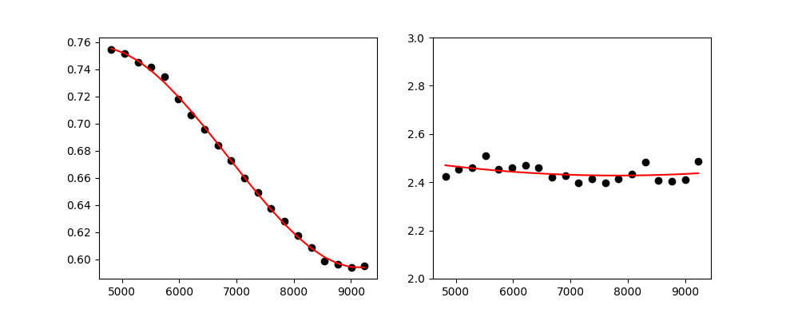

************************************
MUSE specific tools (``mpdaf.MUSE``)
************************************

Python interface for MUSE slicer numbering scheme
=================================================

The `~mpdaf.MUSE.Slicer` class contains a set of static methods to convert
a slice number between the various numbering schemes. The definition of the
various numbering schemes and the conversion table can be found in the *“Global
Positioning System”* document (VLT-TRE-MUSE-14670-0657).

All the methods are static and thus there is no need to instantiate an object
to use this class.

For example, we convert slice number 4 in CCD numbering to SKY numbering:

.. ipython::

  In [1]: from mpdaf.MUSE import Slicer

  In [2]: Slicer.ccd2sky(4)

Now we convert slice number 12 of stack 3 in OPTICAL numbering to CCD numbering:

.. ipython::

  In [3]: Slicer.optical2sky((2, 12))

MUSE LSF models
===============

.. warning:: LSF class is currently under development

Only one model of LSF (Line Spread Function) is currently available.

LSF *qsim_v1*
-------------

This is a simple model where the LSF is supposed to be constant over the filed
of view. It uses a simple parametric model of variation with wavelength.

The model is a convolution of a step function with a Gaussian. The resulting
function is then sample by the pixel size::

    LSF = T(y2+dy/2) - T(y2-dy/2) - T(y1+dy/2) + T(y1-dy/2)

    T(x) = exp(-x**2/2) + sqrt(2*pi)*x*erf(x/sqrt(2))/2

    y1 = (y-h/2) / sigma

    y2 = (y+h/2) / sigma

The slit width is assumed to be constant (h = 2.09 pixels).  The Gaussian sigma
parameter is a polynomial approximation of order 3 with wavelength::

    c = [-0.09876662, 0.44410609, -0.03166038, 0.46285363]

    sigma(x) = c[3] + c[2]*x + c[1]*x**2 + c[0]*x**3

To use it, create a `~mpdaf.MUSE.LSF` object with attribute 'typ' equal to
'qsim_v1':

.. ipython::

  In [1]: from mpdaf.MUSE import LSF

  In [2]: lsf = LSF(typ='qsim_v1')

Then get the LSF array by using `~mpdaf.MUSE.LSF.get_LSF`:

.. ipython::

  In [3]: lsf_6000 = lsf.get_LSF(lbda=6000, step=1.25, size=11)

  In [4]: import matplotlib.pyplot as plt

  In [5]: import numpy as np

  @savefig simple_LSF.png width=4in
  In [6]: plt.plot(np.arange(-5,6), lsf_6000, drawstyle='steps-mid')

MUSE FSF models
===============

.. warning:: FSF class is currently under development

Two models of FSF (Field Spread Function) are currently available:

- `~mpdaf.MUSE.OldMoffatModel` (``model='MOFFAT1'``): the old model with a fixed
  beta **[DEPRECATED]**.

- `~mpdaf.MUSE.MoffatModel2` (``model=2``): a circular MOFFAT with polynomials
  for beta and FWHM.

Example with *MoffatModel2*
---------------------------

The MUSE FSF is modelled as a Circular Moffat function with a FWHM and beta parameter
which varies with the wavelength according to:

    :math:`FWHM = p_0 \times l^n + p_1 \times l^{n-1} + p_n`

    :math:`\beta = k_0 \times l^m + k_1 \times l^{m-1} + k_m`

    :math:`l = (\lambda - \lambda_1) / (\lambda_2 - \lambda_1) - 0.5`

With:

 - :math:`p_i` polynomial coefficient for FWHM polynomial approximation
 - n FWHM polynomial degre
 - :math:`k_i` polynomial coefficient for beta polynomial approximation
 - m beta polynomial degre
 - :math:`\lambda_1`,:math:`lambda_2` reference wavelength for normalisation

We create the `~mpdaf.MUSE.FSFModel` object like this:

.. ipython::

  In [1]: from mpdaf.MUSE import FSFModel, MoffatModel2

  In [2]: fsf = MoffatModel2(fwhm_pol=[-0.2, 0.7], beta_pol=[2.8], lbrange=[4800,9300], pixstep=0.2)

  In [3]: fsf.info()

.. ::

    [INFO] Wavelength range: 4800-9300
    [INFO] FWHM Poly: [-0.2, 0.7]
    [INFO] FWHM (arcsec): 0.80-0.60
    [INFO] Beta Poly: [2.8]
    [INFO] Beta values: 2.80-2.80

There are various way to create a fsf model, by fitting a point source or by using the external
PSF reconstruction module `muse_psfrec`.

Using a star in the field of view
^^^^^^^^^^^^^^^^^^^^^^^^^^^^^^^^^

.. code::

   from mpdaf.obj import cube
   cube = Cube('DATACUBE.fits')
   ra,dec = (53.1583804, -27.7949048)
   fsf = MoffatModel2.from_starfit(cube, (dec,ra), fwhmdeg=3, betadeg=2)

::

    [INFO] FSF from star fit at Ra: 53.15838 Dec: -27.79491 Size 5.1 Nslice 20 FWHM poly deg 3 BETA poly deg 2
    [debug] getting 20 images around object ra:-27.794905 dec:53.158380
    [debug] -- first fit on white light image
    [DEBUG] RA: 53.15837 DEC: -27.79492 FWHM 0.66 BETA 2.39 PEAK 276.5 BACK 0.2
    [DEBUG] -- Second fit on all images
    [DEBUG] 1 RA: 53.15837 DEC: -27.79491 FWHM 0.75 BETA 2.42 PEAK 174.6 BACK 0.1
    [DEBUG] 2 RA: 53.15837 DEC: -27.79491 FWHM 0.75 BETA 2.45 PEAK 151.2 BACK 0.1
    [DEBUG] ......
    [DEBUG] 20 RA: 53.15837 DEC: -27.79493 FWHM 0.60 BETA 2.49 PEAK 293.2 BACK 0.2
    [DEBUG] -- Third fit on all images
    [DEBUG] -- Polynomial fit of BETA(lbda)
    [DEBUG] BETA poly [ 0.07567152 -0.03087214  2.43062733]
    [DEBUG] RA: 53.15837 DEC: -27.79491 FWHM 0.75 BETA 2.47 PEAK 174.0 BACK 0.1
    [DEBUG] RA: 53.15837 DEC: -27.79491 FWHM 0.75 BETA 2.46 PEAK 151.1 BACK 0.1
    [DEBUG] ......
    [DEBUG] RA: 53.15837 DEC: -27.79493 FWHM 0.60 BETA 2.44 PEAK 294.2 BACK 0.2
    [DEBUG] -- Polynomial fit of FWHM(lbda)
    [DEBUG] FWHM poly [ 0.22042019  0.02317024 -0.21365627  0.66766788]
    [DEBUG] -- return FSF model

The fsf.fit dictionary can be used to check the fit quality:

.. code::

    fig,ax = plt.subplots(1,2)
    ax[0].plot(fsf.fit['wave'], fsf.fit['fwhmfit'], 'ok')
    ax[0].plot(fsf.fit['wave'], fsf.fit['fwhmpol'], '-r')
    ax[1].plot(fsf.fit['wave'], fsf.fit['betafit'], 'ok')
    ax[1].plot(fsf.fit['wave'], fsf.fit['betapol'], '-r')
    ax[1].set_ylim(2,3)

Using psfrec
^^^^^^^^^^^^

If the MUSE observations have been done in GLAO WFM mode, then one can get a fsf model
from the AO telemetry information saved in the raw data.

.. warning::

   The psfrec module must be installed. Check https://muse-psfr.readthedocs.io for information.

.. code::

   fsf = MoffatModel2.from_psfrec('MUSE.2018-09-11T05:44:14.890.fits')

::

    [DEBUG] Computing PSF from Sparta data file MUSE.2018-09-11T05:44:14.890.fits
    [INFO] Processing SPARTA table with 13 values, njobs=-1 ...
    [INFO] 6/13 : Using only 3 values out of 4 after outliers rejection
    [INFO] Compute PSF with seeing=0.69 GL=0.64 L0=18.74
    [INFO] Compute PSF with seeing=0.58 GL=0.48 L0=14.40
    [INFO] Using three lasers mode
    [INFO] Compute PSF with seeing=0.58 GL=0.49 L0=16.65
    ......
    [INFO] Compute PSF with seeing=0.69 GL=0.46 L0=15.24
    [INFO] Compute PSF with seeing=0.67 GL=0.56 L0=15.86
    [DEBUG] 01: Seeing 0.69,0.69,0.70,0.69 GL 0.64,0.65,0.64,0.63 L0 18.34,19.04,17.48,20.07
    [DEBUG] 02: Seeing 0.66,0.65,0.69,0.67 GL 0.57,0.56,0.56,0.54 L0 14.87,18.44,14.24,15.89
    ......
    [DEBUG] 12: Seeing 0.67,0.67,0.66,0.65 GL 0.55,0.51,0.52,0.48 L0 9.37,11.07,10.19,13.05
    [DEBUG] 13: Seeing 0.64,0.65,0.69,0.66 GL 0.57,0.56,0.55,0.53 L0 15.43,16.22,12.61,14.41
    [DEBUG] Fitting polynomial on FWHM (lbda) and Beta(lbda)

If the MUSE observations have been done in GLAO WFM mode, then one can get a fsf model
from the AO telemetry information saved in the raw data.

.. warning::

   The psfrec module must be installed. Check https://muse-psfr.readthedocs.io for information.

Methods
-------

Various methods allow one to get the FSF array (2D or 3D, as mpdaf Image or Cube)
for given wavelengths, or the FWHM in pixel and in arcseconds.

.. ipython::

  In [1]: lbda = np.array([5000, 9000])

  In [4]: fsf.get_fwhm(lbda)

  In [5]: fsf.get_fwhm(lbda, unit='pix')

  In [20]: im5000 = fsf.get_2darray(lbda[0], shape=(25, 25))

  In [20]: fsfcube = fsf.get_3darray(lbda, shape=(25, 25))

  In [27]: plt.figure()

  @savefig FSF1.png width=3.5in
  In [26]: plt.imshow(im5000)

  In [27]: plt.figure()

  @savefig FSF2.png width=3.5in
  In [28]: plt.imshow(fsfcube[1])

The FSF model can be saved to a FITS header with
`mpdaf.MUSE.FSFModel.to_header`, and read with `mpdaf.MUSE.FSFModel.read`.

MUSE mosaic field map
=====================

.. warning:: FieldsMap class is currently under development

`~mpdaf.MUSE.FieldsMap` reads the possible FIELDMAP extension of the MUSE data
cube.

.. ipython::

  In [1]: from mpdaf.MUSE import FieldsMap

  In [7]: fmap = FieldsMap('sdetect/subcub_mosaic.fits', extname='FIELDMAP')

`~mpdaf.MUSE.FieldsMap.get_pixel_fields` returns a list of fields that cover
a given pixel (y, x):

.. ipython::

  In [23]: fmap.get_pixel_fields(0,0)

  In [20]: fmap.get_pixel_fields(20,20)

`~mpdaf.MUSE.FieldsMap.get_field_mask` returns an array with non-zeros values
for pixels matching a field:

.. ipython::

  In [14]: plt.figure()

  @savefig fmap1.png width=3.5in
  In [15]: plt.imshow(fmap.get_field_mask('UDF-06'), vmin=0, vmax=1)

  In [14]: plt.figure()

  @savefig fmap2.png width=3.5in
  In [13]: plt.imshow(fmap.get_field_mask('UDF-09'), vmin=0, vmax=1)

Reference/API
=============

.. automodapi:: mpdaf.MUSE
   :no-main-docstr:

.. ipython::
   :suppress:

   In [4]: plt.close("all")

   In [4]: %reset -f
