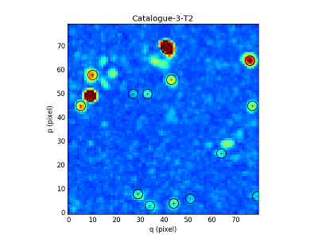

*********************************************************
ORIGIN: detectiOn and extRactIon of Galaxy emIssion liNes
*********************************************************

ORIGIN is a detection algorithm for emission lines.  The strategy of ORIGIN
consists in learning and canceling locally the (unknown) nuisance sources.
These sources can astrophysical sources much brighter than the LAE to be
detected, local residuals caused by imperfect sky subtraction and/or variance
estimation, or faint artifacts due to the overall processing pipeline.  A fast
normalization of the test statistics makes the overall processing
computationally tractable.

This software has been developped in Matlab by Carole Clastres under the
supervision of David Mary (Lagrange institute, University of Nice) and ported
to python by Laure Piqueras (CRAL).

The project is funded by the ERC MUSICOS (Roland Bacon, CRAL).

Please contact Carole for more info at carole.clastres@univ-lyon1.fr

ORIGIN object format
====================

An ORIGIN object is composed by:

- the cube data (raw data and covariance)
- a dictionary of spectral profiles
- a MUSE PSF
- parameters used to segment the cube in zones.

Specifically, an ORIGIN object O consist of:

+-----------------+-----------------------------------------------+
| Component       | Description                                   |
+=================+===============================================+
| O.filename      | Cube FITS file name                           |
+-----------------+-----------------------------------------------+
| O.cube_raw      | Raw data                                      |
+-----------------+-----------------------------------------------+
| O.var           | Variance                                      |
+-----------------+-----------------------------------------------+
| O.Nx            | Number of columns                             |
+-----------------+-----------------------------------------------+
| O.Ny            | Number of rows                                |
+-----------------+-----------------------------------------------+
| O.Nz            | Number of spectral channels                   |
+-----------------+-----------------------------------------------+
| O.wcs           | RA-DEC coordinates                            |
+-----------------+-----------------------------------------------+
| O.wave          | Spectral coordinates                          |
+-----------------+-----------------------------------------------+
| O.intx          | Limits in pixels of the columns for each zone |
+-----------------+-----------------------------------------------+
| O.inty          | Limits in pixels of the rows for each zone    |
+-----------------+-----------------------------------------------+
| O.Edge_xmin     | Minimum limits along the x-axis in pixel      |
+-----------------+-----------------------------------------------+
| O.Edge_xmax     | Maximum limits along the x-axis in pixel      |
+-----------------+-----------------------------------------------+
| O.Edge_ymin     | Minimum limits along the y-axis in pixel      |
+-----------------+-----------------------------------------------+
| O.Edge_ymax     | Maximum limits along the y-axis in pixel      |
+-----------------+-----------------------------------------------+
| O.profiles      | Dictionary of spectral profiles to test       |
+-----------------+-----------------------------------------------+
| O.FWHM_profiles | FWHM of the profiles in pixels                |
+-----------------+-----------------------------------------------+
| O.PSF           | MUSE PSF                                      |
+-----------------+-----------------------------------------------+
| O.FWHM_PSF      | Mean of the fwhm of the PSF in pixel          |
+-----------------+-----------------------------------------------+

Reference
=========

The following methods correspond to different steps of the algorithm:

`mpdaf.sdetect.ORIGIN <mpdaf.sdetect.ORIGIN>` is the classic constructor.

`mpdaf.sdetect.ORIGIN.compute_PCA <mpdaf.sdetect.ORIGIN.compute_PCA>` computes the PCA and returns two cube (faint signal and continuum).

`mpdaf.sdetect.ORIGIN.compute_TGLR <mpdaf.sdetect.ORIGIN.compute_TGLR>` computes the cube of GLR test values.

`mpdaf.sdetect.ORIGIN.compute_pvalues <mpdaf.sdetect.ORIGIN.compute_pvalues>` computes 3 cubes of pvalues (spatial, spectral and final).

`mpdaf.sdetect.ORIGIN.compute_ref_pix <mpdaf.sdetect.ORIGIN.compute_ref_pix>` groups connected voxels and determines the referent pixel of each group.

`mpdaf.sdetect.ORIGIN.compute_NBtests <mpdaf.sdetect.ORIGIN.compute_NBtests>` computes the 2 narrow band tests.

`mpdaf.sdetect.ORIGIN.select_NBtests <mpdaf.sdetect.ORIGIN.select_NBtests>` selects emission lines according to the 2 narrow band tests.

`mpdaf.sdetect.ORIGIN.estimate_line <mpdaf.sdetect.ORIGIN.estimate_line>` computes the estimated emission line and the optimal coordinates for each detected lines.

`mpdaf.sdetect.ORIGIN.merge_spatialy <mpdaf.sdetect.ORIGIN.merge_spatialy>` applies a spatial merging.

`mpdaf.sdetect.ORIGIN.merge_spectraly <mpdaf.sdetect.ORIGIN.merge_spectraly>` applies a spectral merging.

`mpdaf.sdetect.ORIGIN.get_sources <mpdaf.sdetect.ORIGIN.get_sources>` creates the final catalogue of sources.

The following method can be used to visualize the detected lines at each step.

`mpdaf.sdetect.ORIGIN.plot <mpdaf.sdetect.ORIGIN.get_plot>` plots (x,y) on the 2D map of maximum of the T_GLR values over the spectral channels.

Examples
========

Preliminary import::

 >>> from mpdaf.sdetect import ORIGIN

We will test the source detection on a zone (80x80 pixels) of the UDF cube::

 >>> filename = 'UDF-10-subcube43.fits'

In this case, the cube don't need to be spatial segmented (generaly sub-cubes have 70-80 pixels along the spatial axes)::

 >>> NbSubcube = 1

First, we create the ORIGIN object::

 >>> my_origin = ORIGIN(filename, NbSubcube)
 [INFO] ORIGIN - Read the Data Cube
 [INFO] ORIGIN - Load dictionary of spectral profile
 [INFO] ORIGIN - Compute PSF
 [INFO] ORIGIN - Spatial segmentation

The second step applies PCA and returns two cubes containing continuum and faint signal
(*r0* is the coefficient of determination for projection during PCA)::

 >>> r0 = 0.63
 >>> cube_faint, cube_cont = my_origin.compute_PCA(r0)
 [INFO] ORIGIN - Compute the PCA on each zone
 1/1
 [INFO] ORIGIN - Compute the number of eigenvectors to keep for the projection
 [INFO] ORIGIN - Adaptive projection of the cube on the eigenvectors
 >>> plt.figure()
 >>> ax1 = plt.subplot(1,2,1)
 >>> cube_faint.sum(axis=0).plot(ax=ax1, title='faint signal', colorbar='v')
 >>> ax2 = plt.subplot(1,2,2)
 >>> cube_cont.sum(axis=0).plot(ax=ax2, title='continuum', colorbar='v')

.. figure:: _static/origin/cubes_faint_cont.png
  :align: center

In the third step, we compute the cube of GLR test values obtained with the given PSF and the dictionary of spectral profiles::

 >>> correl, profile = my_origin.compute_TGLR(cube_faint)
 [INFO] ORIGIN - Compute the GLR test
  19/19

*correl* contains the values of the GLR test, *profile* contains the index of the profile associated to the GRL test.

The fourth step computes:
  - the p-values associated to the T_GLR values,
  - the p-values associated to the number of thresholded p-values of the correlations per spectral channel,
  - the final p-values which are the thresholded pvalues associated to the T_GLR values divided by twice the pvalues associated to the number of thresholded p-values of the correlations per spectral channel.

*threshold* is the threshold applied on pvalues::

 >>> threshold = 8
 >>> cube_pval_correl, cube_pval_channel, cube_pval_final = my_origin.compute_pvalues(correl, threshold)
 [INFO] ORIGIN - Compute p-values of correlation values
 [INFO] ORIGIN - Compute p-values of spectral channel
 [INFO] ORIGIN - Compute final p-values

The fifth step determines groups of connected voxels with a flood-fill algorithm on the cube of final thresholded p-values.
Then it computes referent voxel of each group of connected voxels using the voxel with the higher T_GLR value and returns a first catalogue (astropy.Table).

*neighboors* gives the connectivity used to define the contiguous voxels::

 >>> neighboors = 26
 >>> Cat0 = my_origin.compute_ref_pix(correl, profile, cube_pval_correl, cube_pval_channel, cube_pval_final, neighboors)
 [INFO] ORIGIN - Compute connected voxelsx(correl, profile, cube_pval_correl, cube_pval_channel, cube_pval_final, neighboors)
 [INFO] ORIGIN - 32 connected voxels detected
 [INFO] ORIGIN - Compute referent pixels
 >>> Cat0
 <Table length=32>
   x     y     z       T_GLR     profile       pvalC             pvalS             pvalF
 int64 int64 int64    float64     int64       float64           float64           float64
 ----- ----- ----- ------------- ------- ----------------- ----------------- -----------------
    44     3   108 11.1813782442       4 6.03889604989e-10    0.983069768704 3.07144835602e-10
    29     8   334 14.0199753667       1 5.10702591328e-15    0.751859833268 3.39626196753e-15
    ...
    18    58  3401 11.0877454814       0 8.47898307121e-10    0.999767138706 4.24047897903e-10
    19    58  3649 15.6654015868      19  1.1985091468e-94    0.291179828957 2.05802227286e-94

We plot the referent pixels::

 >>> my_origin.plot(correl, Cat0['x'], Cat0['y'], title='Catalogue-0-ref-voxel')

The sixth step selects emission lines according to the 2 narrow band tests
(testing for a line in raw data and testing the energy in raw data).

*nb_ranges* is the number of the spectral ranges skipped to compute the controle cube.

*thresh_T1* and *thresh_T2* are thresholds use during the selection::

 >>> nb_ranges = 3
 >>> Cat1 = my_origin.compute_NBtests(Cat0, nb_ranges)
 [INFO] ORIGIN - Compute narrow band tests
 >>> Cat1
 <Table length=32>
   x     y     z       T_GLR     profile       pvalC             pvalS             pvalF             T1             T2
 int64 int64 int64    float64     int64       float64           float64           float64         float64        float64
 ----- ----- ----- ------------- ------- ----------------- ----------------- ----------------- -------------- --------------
    44     3   108 11.1813782442       4 6.03889604989e-10    0.983069768704 3.07144835602e-10  2.59015216751  5.94196007744
    29     8   334 14.0199753667       1 5.10702591328e-15    0.751859833268 3.39626196753e-15  2.72923982756  6.10345238983
    ...
    18    58  3401 11.0877454814       0 8.47898307121e-10    0.999767138706 4.24047897903e-10 0.683582965317 0.988306966226
    19    58  3649 15.6654015868      19  1.1985091468e-94    0.291179828957 2.05802227286e-94 -19.2700431036 -9.84903514651
 >>> thresh_T1 = .2
 >>> thresh_T2 = 2
 >>> Cat1_T1, Cat1_T2 = my_origin.select_NBtests(Cat1, thresh_T1, thresh_T2)
 [INFO] ORIGIN - 23 emission lines selected with the test 1
 [INFO] ORIGIN - 26 emission lines selected with the test 2

We visualize the resulted catalogues::

 >>> plt.figure()
 >>> ax1 = plt.subplot(1,3,1)
 >>> my_origin.plot(correl, Cat1['x'], Cat1['y'], ax=ax1, title='Catalogue-1')
 >>> ax2 = plt.subplot(1,3,2)
 >>> my_origin.plot(correl, Cat1_T1['x'], Cat1_T1['y'], ax=ax2, title='Catalogue-1-T1')
 >>> ax3 = plt.subplot(1,3,3)
 >>> my_origin.plot(correl, Cat1_T2['x'], Cat1_T2['y'], ax=ax3, title='Catalogue-1-T2')

.. figure:: _static/origin/Cat1.png
  :align: center

The seventh step estimates more precisely each emission line.
It uses the catalogue from the narrow band Test number 2::

 >>> Cat2_T2, Cat_est_line = my_origin.estimate_line(Cat1_T2, profile, cube_faint)
 >>> my_origin.plot(correl, Cat2_T2['x'], Cat2_T2['y'], circle=True, title='Catalogue-2-T2')

.. figure:: _static/origin/Cat2.png
  :align: center

*Cat2_T2* completes *Cat1_T2* with the flux and the residual of the lines.

*Cat_est_line* is a list of `mpdaf.obj.Spectrum` that gives the data profile and the SNR of each line.

The eighth step makes a spatial merging in order to associate several lines to the same source::

 >>> Cat3 = my_origin.merge_spatialy(Cat2_T2)
 >>> my_origin.plot(correl, Cat3['x_circle'], Cat3['y_circle'], circle=True, title='Catalogue-3-T2')

The ninth step is the spectral merging.
*deltaz* defines the distance maximum between 2 different lines (in pixels)::

 >>> deltaz = 1
 >>> Cat4 = my_origin.merge_spectraly(Cat3, Cat_est_line, deltaz)
 >>> my_origin.plot(correl, Cat4['x_circle'], Cat4['y_circle'], circle=True, title='Catalogue-final-T2')

.. figure:: _static/origin/Cat4.png
  :align: center

The last step adds corresponding RA/DEC to the catalogue and
creates a list of `mpdaf.sdetect.Source` objects::

 >>> sources = my_origin.get_sources(Cat4, Cat_est_line, correl)

A source corresponds to a group on detected emission lines and contains:
 - the spatial position in world coordinates,
 - the 2D map of maximum of the T_GLR values (*MAXMAP*),
 - the estimated spectrum of each detected emission line (*LINExxxx*),
 - the spectrum of correlation of each detected emission line (*CORRxxxx*),
 - the observed wavelength of each detected emission line,
 - P-values of GLR test statistics for each detected emission line,
 - narrow band test values for each detected emission line,
 - the corresponding index of the profile.

For example, the first source of the list::

 >>> sources[0].info()
 [INFO] ID      =                    1 / object ID u.unitless %d
 [INFO] RA      =    53.15859585425986 / RA u.degree %.7f
 [INFO] DEC     =   -27.77043838806513 / DEC u.degree %.7f
 [INFO] ORIGIN  = 'ORIGIN  '           / detection software
 [INFO] ORIGIN_V= 'V1.1    '           / version of the detection software
 [INFO] CUBE    = 'UDF-10-subcube43.fits' / MUSE data cube
 [INFO] X       =                 41.0 / x position in pixel u.pix %d
 [INFO] Y       =    68.93860664672712 / y position in pixel u.pix %d

 [INFO] spectra['LINE0006'],21 elements (8656.25-8681.25 A) .data .var
 [INFO] spectra['LINE0004'],21 elements (7917.50-7942.50 A) .data .var
 [INFO] spectra['LINE0005'],25 elements (8177.50-8207.50 A) .data .var
 [INFO] spectra['LINE0002'],29 elements (7431.25-7466.25 A) .data .var
 [INFO] spectra['LINE0003'],21 elements (7755.00-7780.00 A) .data .var
 [INFO] spectra['LINE0001'],17 elements (8816.25-8836.25 A) .data .var
 [INFO] spectra['CORR0002'],29 elements (7431.25-7466.25 A) .data
 [INFO] spectra['CORR0003'],21 elements (7755.00-7780.00 A) .data
 [INFO] spectra['CORR0001'],17 elements (8816.25-8836.25 A) .data
 [INFO] spectra['CORR0006'],21 elements (8656.25-8681.25 A) .data
 [INFO] spectra['CORR0004'],21 elements (7917.50-7942.50 A) .data
 [INFO] spectra['CORR0005'],25 elements (8177.50-8207.50 A) .data
 [INFO] images['NB_LINE0006'] 25 X 25 .data .var rot=-0.0 deg
 [INFO] images['NB_LINE0004'] 25 X 25 .data .var rot=-0.0 deg
 [INFO] images['NB_LINE0005'] 25 X 25 .data .var rot=-0.0 deg
 [INFO] images['NB_LINE0002'] 25 X 25 .data .var rot=-0.0 deg
 [INFO] images['NB_LINE0003'] 25 X 25 .data .var rot=-0.0 deg
 [INFO] images['NB_LINE0001'] 25 X 25 .data .var rot=-0.0 deg
 [INFO] images['MUSE_WHITE'] 25 X 25 .data .var rot=-0.0 deg
 [INFO] images['MAXMAP'] 24 X 25 .data  rot=-0.0 deg
 [INFO] cubes['MUSE_CUBE'] 3681 X 25 X 25 .data .var rot=-0.0 deg

 [INFO] lines
 [INFO] LBDA_OBS FWHM_OBS    FLUX_OBS   GLR   PVALC   PVALS   PVALF   T1   T2  PROF
 [INFO] Angstrom Angstrom erg / (cm2 s)
 [INFO] -------- -------- ------------- ---- ------- ------- ------- ---- ---- ----
 [INFO]  8826.25     2.50         -99.2 10.8 2.5e-09 9.9e-01 1.3e-09  7.7  2.7    0
 [INFO]  7448.75     4.47         671.1 55.9 1.2e-94 6.0e-15 1.0e-80 71.3 76.6    3
 [INFO]  7767.50     3.16           5.5 13.0 5.0e-13 9.6e-01 2.6e-13 -3.2  5.3    1
 [INFO]  7930.00     3.16          47.5 13.3 1.4e-13 9.1e-01 7.6e-14 -7.7  4.0    1
 [INFO]  8192.50     3.82         -12.3 19.1 1.2e-94 2.9e-01 2.1e-94 -2.2 10.5    2
 [INFO]  8668.75     3.16          75.8 14.5 5.6e-16 9.1e-01 3.0e-16 14.1 30.6    1

