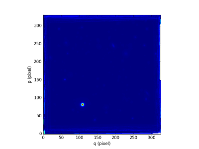
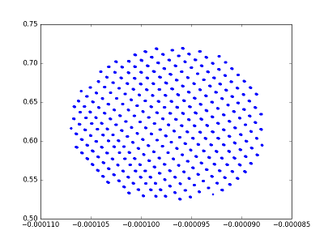
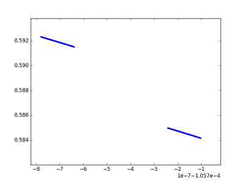
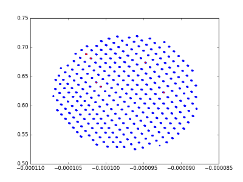
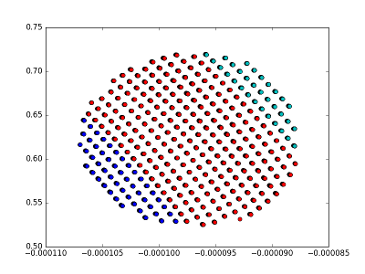
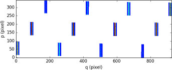
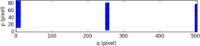
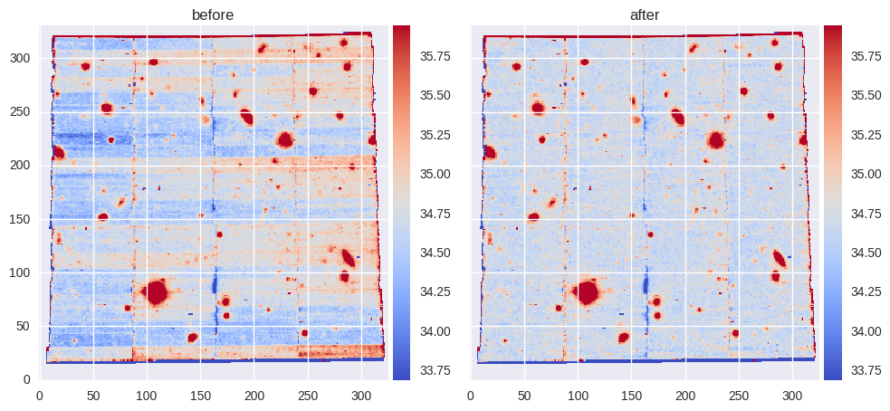

***************
PixTable object
***************

In the reduction approach of the MUSE pipeline, data need to be kept
un-resampled until the very last step.  The pixel tables used for this purpose
can be saved at each intermediate reduction step and hence contain lists of
pixels together with output coordinates and values.  The pixel tables values
and units change according to the reduction step. Please consult the data
reduction user manual for further informations.

The `~mpdaf.drs.PixTable` object is used to handle the MUSE pixel tables
created by the data reduction system. The PixTable object can be read and write
to disk and a few functions can be performed on the object.  Note that pixel
tables are saved as FITS binary tables or as multi-extension FITS images (data
reduction software version 0.08 or above). A PixTable object detects the file
format and acts accordingly. But by default PixTable object writes to disk
using the multi-extension FITS images option because it's faster. A 8.2 GB
pixel table can be saved 3x faster as FITS images and loaded 5x faster compared
to saving and loading as FITS table.

Also pixtable can be very large and then used a lot of RAM. To use efficiently
the memory, the file is open in memory mapping mode when a PixTable object is
created from an input FITS file: i.e. the arrays are not in memory unless they
are used by the script.

PixTable format
===============

+--------+-------+------------------------------------------------------+--------------------------------------+
| Array  | Type  | Description                                          | Units                                |
+========+=======+======================================================+======================================+
| xpos   | float | x position of the pixel within the field of view     | pixel, rad, deg                      |
+--------+-------+------------------------------------------------------+--------------------------------------+
| ypos   | float | y position of the pixel within the field of view     | pixel, red, deg                      |
+--------+-------+------------------------------------------------------+--------------------------------------+
| lambda | float | wavelength assigned to the pixel                     | Angstrom                             |
+--------+-------+------------------------------------------------------+--------------------------------------+
| data   | float | data value                                           | count, 10**-20 erg/s/cm**2/A         |
+--------+-------+------------------------------------------------------+--------------------------------------+
| dq     | int   | 32bit bad pixel status (in Euro3D convention)        |                                      |
+--------+-------+------------------------------------------------------+--------------------------------------+
| stat   | float | data variance estimation                             | count**2, (10**-20 erg/s/cm**2/A)**2 |
+--------+-------+------------------------------------------------------+--------------------------------------+
| origin | int   | pixel location on detector, slice and channel number |                                      |
+--------+-------+------------------------------------------------------+--------------------------------------+

The origin column is composed of the IFU and slice numbers and the x and
y coordinates on the originating CCD. Using bit shifting and information in the
FITS headers these four numbers are encoded in a single 32bit integer. Note
that the `~mpdaf.MUSE` package  provides a `~mpdaf.MUSE.Slicer` class
to convert the slicer number between various numbering schemes.

Read a pixtable, display informations and extract a smaller pixtable centered around an object
==============================================================================================

Preliminary imports::

  In [1]: import numpy as np

  In [2]: import matplotlib.pyplot as plt

  In [3]: from mpdaf.drs import PixTable

We read the `~mpdaf.drs.PixTable` from the disk and check its basic
informations (`~mpdaf.drs.PixTable.info`) and FITS header content::

  In [4]: pix = PixTable('PIXTABLE-MUSE.2014-07-26T04:37:08.541.fits')

  In [5]: pix.info()
  [INFO] 24 merged IFUs went into this pixel table
  [INFO] This pixel table was flux-calibrated
  [INFO] projected (intermediate) (Gnomonic proje)
  Filename: PIXTABLE-MUSE.2014-07-26T04:37:08.541.fits
  No.    Name         Type      Cards   Dimensions   Format
  0    PRIMARY     PrimaryHDU    2232   ()
  1    xpos        ImageHDU         9   (1, 323885723)   float32
  2    ypos        ImageHDU         9   (1, 323885723)   float32
  3    lambda      ImageHDU         9   (1, 323885723)   float32
  4    data        ImageHDU         9   (1, 323885723)   float32
  5    dq          ImageHDU         8   (1, 323885723)   int32
  6    stat        ImageHDU         9   (1, 323885723)   float32
  7    origin      ImageHDU         8   (1, 323885723)   int32
  [INFO] None

  In [6]: print(pix.nrows)
  323885723

This is a pixtable containing a MUSE exposure of HDFS.  Note that the current
table has 323885723 pixels. It corresponds to the full MUSE field for a single
exposure. Let's look to the corresponding reconstructed image from the
associated datacube::

  In [7]: from mpdaf.obj import Image

  In [8]: rec = Image('IMAGE-HDFS-v1.11.fits')

  In [9]: rec.info()
  [INFO] 331 x 326 Image (/muse/HDFS/public/dataproducts/HDFS-DataProducts-v1.11/IMAGE-HDFS-v1.11.fits)
  [INFO] .data(331 x 326) (1e-20 ct), .var(331 x 326)
  [INFO] center:(-60:33:49.0427,22:32:55.53) size in arcsec:(66.139,65.126) step in arcsec:(0.200,0.200) rot:0.1 deg

  In [10]: plt.figure()
  Out[10]: <matplotlib.figure.Figure at 0x7ff6d7b3a550>

  In [11]: rec.plot(scale='arcsinh')
  Out[11]: <matplotlib.image.AxesImage at 0x7ff6d7935910>

We are interested in the brightest object. Let's find its position by using `~mpdaf.obj.Image.peak`::

  In [12]: peak = rec.peak()

Now we will use `~mpdaf.drs.PixTable.extract` to extract a circular region of the pixtable centered around the object and we will restrict
the wavelength to the 6000:6100 Angstrom range::

  In [13]: objpix = pix.extract(filename='Star_pixtable.fits',sky=(peak['y'], peak['x'], 2., 'C'), lbda=(6000,6100))

  In [14]: objpix.nrows
  Out[14]: 24441

Note that we have extracted a circular ('C') region of 2 arcseconds
around the object.  The new pixtable (``objpix``) is much smaller, only 24441
pixels. The pixtable has been saved as a FITS file (Star_pixtable.fits).

The method `~mpdaf.drs.PixTable.extract` can extract a subset of a pixtable
using the following criteria:

- aperture on the sky (center, size and shape),
- wavelength range,
- IFU numbers,
- slice numbers,
- detector pixels,
- exposure numbers,
- stack numbers.

`~mpdaf.drs.PixTable.extract` creates a mask columns for all criteria, merges
the masks and returns a new pixtable extracted with the final mask.  These
methods are also available to do the extraction step par step:

 - `~mpdaf.drs.PixTable.select_lambda` returns a mask corresponding to the given wavelength range,
 - `~mpdaf.drs.PixTable.select_stacks` returns a mask corresponding to given stacks,
 - `~mpdaf.drs.PixTable.select_slices` returns a mask corresponding to given slices,
 - `~mpdaf.drs.PixTable.select_ifus` returns a mask corresponding to given ifus,
 - `~mpdaf.drs.PixTable.select_exp` returns a mask corresponding to given exposures,
 - `~mpdaf.drs.PixTable.select_xpix` and `~mpdaf.drs.PixTable.select_ypix` return a mask corresponding to detector pixels,
 - `~mpdaf.drs.PixTable.select_sky` returns a mask corresponding to the given aperture on the sky,
 - `~mpdaf.drs.PixTable.extract_from_mask` returns a new pixtable extracted with the given mask.

Let's investigate this pixtable.  `~mpdaf.drs.PixTable.get_xpos` and
`~mpdaf.drs.PixTable.get_ypos` return the relative x/y position of the pixel to
the center of the field of view.  We start by plotting the sky positions::

  In [15]: x = objpix.get_xpos()

  In [16]: y = objpix.get_ypos()

  In [17]: plt.figure()
  Out[17]: <matplotlib.figure.Figure at 0x7ff495869fd0>

  In [18]: plt.plot(y, x, '.')
  Out[18]: [<matplotlib.lines.Line2D at 0x7ff495a8bfd0>]

Ok, we have a circular location of pixels as expected. Note that the plotted
points seems to be 'thick'. We can check this by zooming. For example if we
zoom to the two points on the left side, this what we obtain.

This is typical of the pixel table. Because of distortion each pixel on the
detector has not exactly the same location on the sky for the various
wavelength.  Let's see if we have some bad pixel identified.
`~mpdaf.drs.PixTable.get_dq` gets the dq column.::

  In [19]: dq = objpix.get_dq()

  In [20]: k = np.where(dq > 0)

  In [21]: k
  Out[21]:
  (array([ 9363, 13049, 14485, 14611, 14738, 15074, 15158, 15199, 15704,
        15830, 21261, 21279]),)

  In [22]: plt.plot(y[k], x[k], 'r.')
  Out[22]: [<matplotlib.lines.Line2D at 0x7ff495ab68d0>]

Indeed there are 12 bad pixels localised in 6 areas of the detectors. We can
see their location as the red points in the plot.  Let's now investigate how
this object is mapped on the detector. We start to get the origin array with
`~mpdaf.drs.PixTable.get_origin`::

  In [23]: origin = objpix.get_origin()

Several methods exists to decode it:

 - `~mpdaf.drs.PixTable.origin2ifu` returns the ifu number of each pixel,
 - `~mpdaf.drs.PixTable.origin2slice` returns the slice number of each pixel,
 - `~mpdaf.drs.PixTable.origin2xpix` returns the x coordinates of the pixels on the detector,
 - `~mpdaf.drs.PixTable.origin2ypix` returns the y coordinates of the pixels on the detector,
 - `~mpdaf.drs.PixTable.origin2coords` returns (ifu, slice, ypix, xpix).

For example we decode the origin array to get the IFU number::

  In [24]: ifu = objpix.origin2ifu(origin)

  In [25]: np.unique(ifu)
  Out[25]: array([5, 6, 7], dtype=uint8)

  In [26]: k = np.where(ifu == 5)

  In [27]: plt.plot(y[k],x[k],'ob')
  Out[27]: [<matplotlib.lines.Line2D at 0x7ff4957c0c50>]

  In [28]: k = np.where(ifu == 6)

  In [29]: plt.plot(y[k],x[k],'or')
  Out[29]: [<matplotlib.lines.Line2D at 0x7ff495854850>]

  In [30]: k = np.where(ifu == 7)

  In [31]: plt.plot(y[k],x[k],'oc')
  Out[31]: [<matplotlib.lines.Line2D at 0x7ff495854f10>]

We can see that the star is split into three IFUs (5, 6 and 7). We plot the sky
location according to the IFU number.

Now we are going to display the data as located on the original exposure.  Firs
we have to compute separately the corresponding pixtable for each IFU
(`~mpdaf.drs.PixTable.extract`) and then we use the sub-pixtable to reconstruct
the originating CCD image (`~mpdaf.drs.PixTable.reconstruct_det_image`)::

  In [32]: objpix5 = pix.extract(filename='Star_pixtable.fits',sky=(peak['y'], peak['x'], 2., 'C'), lbda=(6000,6100), ifu=5)

  In [33]: ima5 = objpix5.reconstruct_det_image()

  In [34]: plt.figure()
  Out[34]: <matplotlib.figure.Figure at 0x7ff495a670d0>

  In [35]: ima5.plot(vmin=0, vmax=200)
  Out[35]: <matplotlib.image.AxesImage at 0x7ff495712410>

  In [36]: objpix6 = pix.extract(filename='Star_pixtable.fits',sky=(peak['y'], peak['x'], 2., 'C'), lbda=(6000,6100), ifu=6)

  In [37]: ima6 = objpix6.reconstruct_det_image()

  In [38]: plt.figure()
  Out[38]: <matplotlib.figure.Figure at 0x7ff495854e90>

  In [39]: ima6.plot(vmin=0, vmax=200)
  Out[39]: <matplotlib.image.AxesImage at 0x7ff6d72dd090>

  In [40]: objpix7 = pix.extract(filename='Star_pixtable.fits',sky=(peak['y'], peak['x'], 2., 'C'), lbda=(6000,6100), ifu=7)

  In [41]: ima7 = objpix7.reconstruct_det_image()

  In [42]: plt.figure()
  Out[42]: <matplotlib.figure.Figure at 0x7ff49576b0d0>

  In [43]: ima7.plot(vmin=0, vmax=200)
  Out[43]: <matplotlib.image.AxesImage at 0x7ff4953c2cd0>

.. image::  _static/pixtable/ima5.png

This give a good view of the pixels that comes into the object for the
wavelength 6000:6100 Angstrom.  Note that we restricted the wavelength range in
the `~mpdaf.drs.PixTable.extract` method.  It would be also possible to used
`~mpdaf.drs.PixTable.reconstruct_det_waveimage` that reconstructs the image of
wavelength values on the detector from the pixtable.

Use the pixtable's data
=======================

We will see how to use the pixel table to fit a 2D gaussian for a restricted
wavelength range.  We start to define a function that fit a 2D gaussian to
a set of points (x, y, data)::

  In [44]: from scipy.optimize import leastsq

  In [45]: def fitgauss(x, y, data, peak, center, fwhm):
     ....:     p0 = np.array([peak, center[0], center[1], fwhm/2.355])
     ....:     res = leastsq(gauss2D, p0, args=[x, y, data])
     ....:     return res
     ....:

  In [46]: def gauss2D(p, arglist):
     ....:     x, y, data = arglist
     ....:     peak, x0, y0, sigma = p
     ....:     g = peak*np.exp(-((x-x0)**2 + (y-y0)**2)/(2*sigma**2))
     ....:     residual = data - g
     ....:     return residual
     ....:

Let's check if it works::

  In [47]: y, x = np.meshgrid(np.arange(10), np.arange(10))

  In [48]: g = 2.0*np.exp(-((x-5)**2+(y-5)**2)/(2*1.7**2))

  In [49]: gn = np.random.normal(g, 0.1*np.sqrt(g))

  In [50]: xp = x.ravel()

  In [51]: yp = y.ravel()

  In [52]: gnp = gn.ravel()

  In [53]: fitgauss(xp, yp, gnp, 1.0, (4.9,5.1), 2*2.355)
  Out[53]: (array([ 1.97698318,  4.98185621,  4.94862697,  1.70022846]), 1)

OK, so now we can test it on our object pixtable::

  In [54]: x = objpix.get_xpos()

  In [55]: y = objpix.get_ypos()

  In [56]: data = objpix.get_data()

  In [57]: center = (0,0)

  In [58]: res = fitgauss(y, x, data, data.max(), center, 0.7/3600.)

  In [59]: print('Peak:',res[0][0], 'Center:',res[0][1:3], 'Fwhm:',res[0][3]*2.355*3600)
  Peak: 1465.94006348 Center: [ 0.  0.] Fwhm: 0.7

We have used `~mpdaf.drs.PixTable.get_data` to have the data column.  It exists
a getter and a setter for each column of the pixtable.  We recommend that you
use these setters to update a pixtable because they preserve the consistency of
the file by updating the FITS header.

In place of the relative coordinates, we can use the absolute position on the
sky given by `~mpdaf.drs.PixTable.get_pos_sky`::

  In [60]: y, x = objpix.get_pos_sky()

  In [61]: center = (peak['y'], peak['x'])

  In [62]: res = fitgauss(y, x, data, data.max(), center, 0.7/3600.)

  In [63]: print('Peak:',res[0][0], 'Center:',res[0][1:3], 'Fwhm:',res[0][3]*2.355*3600)
  Peak: 1465.94006348 Center: [ -60.56826963  338.23752675] Fwhm: 0.7

Self-calibration method for empty fields
========================================

The `~mpdaf.drs.PixTable` class has a `~mpdaf.drs.PixTable.selfcalibrate`
method, which can be used to apply a self-calibration method on a pixel table
to bring all slices to the same median value. This is useful to remove residual
IFU and slice mean level variations. It was designed to work on sparse fields,
where objects are small compared to the size of a slice. This is because it
needs to mask the sources, in order to extract reliably the mean sky value. And
the correction for a slice cannot be computed if all its pixels are masked.

.. note:: The method **requires a pixel table that is not
   sky-subtracted**, because it uses the mean sky level as a reference level.

The figure below gives an example on an HDFS exposure, showing the white-light
image before an after the correction. Note that this correction varies with the
wavelength as it is computed on wavelength bins of 200 to 300 Angstroms. The
docstring of `~mpdaf.drs.PixTable.selfcalibrate` gives more details on the
algorithm.

As an example, the pixtable previously loaded contains a MUSE exposure of the
HDFS.  This is a reduced pixtable produced by ``muse_scipost``, without sky
subtraction.  We will mask out all bright continuum objects present in the FoV.
We use a mask which has been produced by SExtractor on the corresponding white
light image of this exposure.

`~mpdaf.drs.PixTable.mask_column` method returns a `~mpdaf.drs.PixTableMask`
object containing the mask as a new column.  We save this mask column as a FITS
table::

  In [64]: mask = pix.mask_column('Mask-HDF-110814.fits')

  In [65]: mask.write('maskcol.fits')

Then we can run the self-calibration::

  In [69]: autocalib = pix.selfcalibrate(pixmask=mask)

`~mpdaf.drs.PixTable.selfcalibrate` is coded in C for efficiency.  It returns
a `~mpdaf.drs.PixTableAutoCalib` object that contains the corrections per
slice, and let the user save the calibration information in a fits file::

  In [70]: autocalib.write('autocalib-PIXTABLE-MUSE.2014-07-26T04:37:08.541.fits')

Finally, we save this corrected pixel table (`~mpdaf.drs.PixTable.write`)::

  In [71]: pix.write('corr-PIXTABLE-MUSE.2014-07-26T04:37:08.541.fits')

This non sky subtracted corrected pixtable can then be used to create
a datacube with the appropriate pipeline recipe. Sky subtraction can then be
performed with the zap software.

.. warning::

   The use of OpenMP by MPDAF could hand an other process using OpenMP during
   the same Python program. This problem only affects GCC; ICC is not affected.
   There is currently no workaround; the solution is to stop MPDAF before
   starting on other process using OpenMP.
