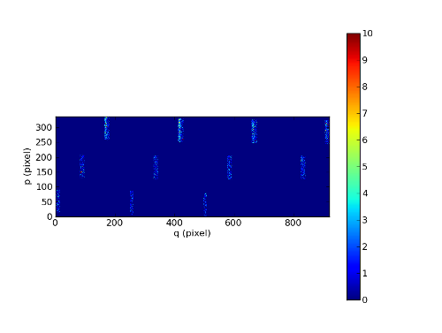

***************
PixTable object
***************

In the reduction approach of the MUSE pipeline, data need to be kept
un-resampled until the very last step.  The pixel tables used for this purpose
can be saved at each intermediate reduction step and hence contain lists of
pixels together with output coordinates and values.  The pixel tables values
and units change according to the reduction step. Please consult the data
reduction user manual for further informations.

The PixTable python object is used to handle the MUSE pixel tables created by
the data reduction system. The PixTable object can be read and write to disk
and a few functions can be performed on the object.  Note that pixel tables are
saved as FITS binary tables or as multi-extension FITS images (data reduction
software version 0.08 or above). PixTable python object detects the file format
and acts accordingly. But by default PixTable object writes to disk using the
multi-extension FITS images option because it's faster. A 8.2 GB pixel table
can be saved 3x faster as FITS images and loaded 5x faster compared to saving
and loading as FITS table.

Also pixtable can be very large and then used a lot of RAM. To use efficiently
the memory, the file is open in memory mapping mode when a PixTable object is
created from an input FITS file: i.e. the arrays are not in memory unless they
are used by the script.

Format
======

+------------+-------+--------------------------------------------------------+--------------------------------------+
| Array      | Type  | Description                                            | Units                                |
+============+=======+========================================================+======================================+
| xpos       | float | x position of the pixel within the field of view       | pixel, rad, deg                      |
+------------+-------+--------------------------------------------------------+--------------------------------------+
| ypos       | float | y position of the pixel within the field of view       | pixel, red, deg                      |
+------------+-------+--------------------------------------------------------+--------------------------------------+
| lambda     | float | wavelength assigned to the pixel                       | Angstroem                            |
+------------+-------+--------------------------------------------------------+--------------------------------------+
| data       | float | data value                                             | count, 10**-20 erg/s/cm**2/A         |
+------------+-------+--------------------------------------------------------+--------------------------------------+
| dq         | int   | 32bit bad pixel status (in Euro3D convention)          |                                      |
+------------+-------+--------------------------------------------------------+--------------------------------------+
| stat       | float | data variance estimation                               | count**2, (10**-20 erg/s/cm**2/A)**2 |
+------------+-------+--------------------------------------------------------+--------------------------------------+
| origin     | int   | pixel location on detector, slice and channel number   |                                      |
+------------+-------+--------------------------------------------------------+--------------------------------------+

The origin column is composed of the IFU and slice numbers and the x and
y coordinates on the originating CCD. Using bit shifting and information in the
FITS headers these four numbers are encoded in a single 32bit integer. Note
that the `MUSE package <tools.html>`_  provides a `Slicer class <slicer.html>`_
to convert the slicer number between various numbering schemes.

Tutorials
=========

We can load the tutorial files with the command::

  git clone http://urania1.univ-lyon1.fr/git/mpdaf_data.git

Preliminary imports for all tutorials::

  >>> import numpy as np
  >>> import matplotlib.pyplot as plt
  >>> from mpdaf.drs import PixTable

Tutorial 1
----------

In this tutorial we will learn how to read a pixtable, display informations and
extract a smaller pixtable centered around an object. We will also learn how to
display the original detector pixels which belong to the object.

We read the pixtable from the disk and check its basic informations and FITS header content::

 >>> pix = PixTable('Central_PIXTABLE_REDUCED_11_positioned.fits')
 >>> pix.info()
 Filename: Central_PIXTABLE_REDUCED_11_positioned.fits
 No.    Name         Type      Cards   Dimensions   Format
 0    PRIMARY     PrimaryHDU    1614   ()           uint8
 1                BinTableHDU     29   29960130R x 7C   [E, E, E, E, J, E, J]
 >>> print pix.primary_header
 ...........
 HIERARCH ESO PRO MUSE PIXTABLE LIMITS SLICE HIGH = 48
 HIERARCH ESO TMP FILE = '../Output/dry-run-ref_000_001_001.fits'
 AUTHOR  = 'MPDAF   '           / origin of the file
 COMMENT   and Astrophysics', volume 376, page 359; bibcode: 2001A&A...376..359H
 >>> print pix.nrows
 >>> 29960130

Note that the current table has 29960130 pixels. It is only 1/9 of the full
MUSE field for a single exposure.  It has been fully reduced. The corresponding
reconstructed image from the associated datacube is available.  Let's look to
it::

 >>> from mpdaf.obj import Image
 >>> rec = Image('REC_Central_PIXTABLE_REDUCED_11_positioned.fits')
 >>> rec.info()
 100 X 100 image (REC_Central_PIXTABLE_REDUCED_11_positioned.fits)
 .data(100,100) (10**(-20)*erg/s/cm**2/Angstrom) fscale=1, no noise
 center:(-30:00:01.02,01:20:00.123) size in arcsec:(20.000,20.000) step in arcsec:(0.200,0.200) rot:0.0
 >>> rec.plot(scale='arcsinh')

.. figure::  _static/pixtable/recima1.png
   :align:   center

We are interested in the bright object at the bottom. Let's find its position::

 >>> rec.ipos()
 To read cursor position, click on the left mouse button
 To remove a cursor position, click on the left mouse button + <d>
 To quit the interactive mode, click on the right mouse button.
 After quit, clicks are saved in self.clicks as dictionary {y,x,p,q,data}.
 y=-30.0023      x=20.0016       p=14    q=33    data=93985.5
 disconnecting console coordinate printout...

Now we will extract a circular region of the pixtable centered around the object and we will restrict
the wavelength to the 6000:6100 Angstroem range::

 >>> objpix = pix.extract(filename='Star_pixtable.fits',sky=(-30.0023, 20.0015, 2/3600., 'C'), lbda=(6000,6100))
 >>> objpix.nrows
 20558

Note that we have extracted a circular ('C') region of 2 arcsec (2/3600.)
around the object.  The new pixtable (objpix) is much smaller, only 20558
pixels. The pixtable has been saved as a FITS file (Star_pixtable.fits).

Let's investigate this pixtable. We start by plotting the sky positions::

 >>> x = objpix.get_xpos()
 >>> y = objpix.get_ypos()
 >>> plt.plot(y, x, '.')

.. figure::  _static/pixtable/pixima1.png
   :align:   center

Ok, we have a circular location of pixels as expected. Note that the plotted
points seems to be 'thick'. We can check this by zooming. For example if we
zoom to the two points on the left side, this what we obtain.

.. figure::  _static/pixtable/pixima2.png
   :align:   center

This is typical of the pixel table. Because of distortion each pixel on the
detector has not exactly the same location on the sky for the various
wavelength.  Let's see if we have some bad pixel identified::

 >>> dq = objpix.get_dq()
 >>> k = np.where(dq > 0)
 >>> k
 (array([3591, 4791]),)
 >>> plt.plot(y[k], x[k], 'or')

.. figure::  _static/pixtable/pixima3.png
   :align:   center

Indeed there are two bad pixels. We can see their location as the red points in
the plot.  Let's now investigate how this object is mapped on the detector. We
start to get the origin array and then decode it to get for example the IFU
number::

 >>> origin = objpix.get_origin()
 >>> ifu = objpix.origin2ifu(origin)
 >>> np.unique(ifu)
 array([ 9, 10], dtype=int32)
 >>> k = np.where(ifu == 9)
 >>> plt.plot(y[k],x[k],'ob')
 >>> k = np.where(ifu == 10)
 >>> plt.plot(y[k],x[k],'or')

We can see that the star is split into two IFUs (9 and 10). We plot the sky
location according to the IFU number.

.. figure::  _static/pixtable/pixima4.png
   :align:   center

Now we are going to display the data as located on the original exposure.
Before we have to compute separately the corresponding pixtable for each IFU::

 >>> objpix9 = pix.extract(sky=(-30.0023, 20.0015, 2/3600., 'C'), lbda=(6000,6100), ifu=9)
 >>> objpix10 = pix.extract(sky=(-30.0023, 20.0015, 2/3600., 'C'), lbda=(6000,6100), ifu=10)
 >>> ima9 = objpix9.reconstruct_det_image()
 >>> ima10 = objpix10.reconstruct_det_image()
 >>> ima9.plot(vmin=0, vmax=10)
 >>> ima10.plot(vmin=0, vmax=10)

.. image::  _static/pixtable/pixima6.png

This give a good view of the pixels that comes into the object.

Tutorial 2
----------

In this second tutorial we will learn how to use the pixel table to fit a 2D
gaussian for a restricted wavelength range.

We start to define a function that fit a 2D gaussian to a set of points (x, y,
data)::

 >>> from scipy.optimize import leastsq
 >>> def fitgauss(x, y, data, peak, center, fwhm):
 >>>         p0 = np.array([peak, center[0], center[1], fwhm/2.355])
 >>>         res = leastsq(gauss2D, p0, args=[x, y, data])
 >>>         return res
 >>>
 >>> def gauss2D(p, arglist):
 >>>         x, y, data = arglist
 >>>         peak, x0, y0, sigma = p
 >>>         g = peak*np.exp(-((x-x0)**2 + (y-y0)**2)/(2*sigma**2))
 >>>         residual = data - g
 >>>         return residual

Let's check if it works::

 >>> nx = 10
 >>> ny = 10
 >>> x = np.reshape(np.repeat(np.arange(nx),ny),(nx,ny))
 >>> y = np.transpose(np.reshape(np.repeat(np.arange(ny),nx),(ny,nx)))
 >>> g = 2.0*np.exp(-((x-5)**2+(y-5)**2)/(2*1.7**2))
 >>> gn = np.random.normal(g, 0.1*np.sqrt(g))
 >>> xp = x.ravel()
 >>> yp = y.ravel()
 >>> gnp = gn.ravel()
 >>> fitgauss(xp, yp, gnp, 1.0, (4.9,5.1), 2*2.355)
 (array([ 1.94258391,  4.96738244,  5.05566252,  1.71287931]), 1)

OK, so now we can test it on our object pixtable::

 >>> objpix = pix.extract(sky=(-30.0023, 20.0015, 2/3600., 'C'), lbda=(6000,6010))
 >>> x = objpix.get_xpos()
 >>> y = objpix.get_ypos()
 >>> data = objpix.get_data()
 >>> center = (-30.0023, 20.0015)
 >>> res = fitgauss(y, x, data, data.max(), center, 0.7/3600.)
 >>> print 'Peak:',res[0][0], 'Center:',res[0][1:3], 'Fwhm:',res[0][3]*2.355*3600
 Peak: 1080.1060791 Center: [-30.0023  20.0015] Fwhm: 0.7

Tutorial 3: self-calibration method for empty field
---------------------------------------------------

In this last tutorial, we will apply a self-calibration method on a single
pixel table to bring all slices to the same median value. This will work on
fields with small object, e.g. objects smaller than a slice length (15 arcsec).

First we load a pixtable containing a MUSE exposure of HDFS. This is a reduced
pixtable produced by scipost, without sky subtraction.::

 >>> pix = PixTable('sub-PIXTABLE-MUSE.2014-07-27T04:22:08.024.fits')

We will mask out all bright continuum objects present in the FoV.  We use
a mask which has been produced by SExtractor on the corresponding white light
image of this exposure.

`mpdaf.drs.PixTable.mask_column <mpdaf.drs.PixTable.mask_column>` method
returns a `mpdaf.drs.PixTableMask` object containing the mask as a new column.
We save this mask column as a FITS table::

 >>> mask = pix.mask_column('Mask.fits')
 [INFO] masking object 1/69 338.247<x<338.248 -60.5716<y<-60.5712 (3745 pixels)
 [INFO] masking object 2/69 338.214<x<338.215 -60.5715<y<-60.5711 (2496 pixels)
 [INFO] masking object 3/69 338.233<x<338.234 -60.5711<y<-60.5702 (14650 pixels)
 [INFO] masking object 4/69 338.246<x<338.246 -60.571<y<-60.5706 (2299 pixels)
  ...
 [INFO] masking object 69/69 338.232<x<338.234 -60.5552<y<-60.5548 (7416 pixels)
 >>> mask.write('maskcol.fits')

Then, we estimate a reference sky spectrum from the masked pixel table::

 >>> skyref = pix.sky_ref(pixmask=mask)
 >>> skyref.write('skyref.fits')

`sky_ref <mpdaf.drs.PixTable.sky_ref>` returns a `mpdaf.obj.Spectrum`. Let’s look to it::

 >>> skyref.plot()

.. image::  _static/pixtable/skyref.png

This reference spectrum is used by the auto calibration method to normalise
data values in each MUSE slice.  In this example, we choose to use the additive
correction::

 >>> pix.subtract_slice_median(skyref, pixmask=mask)

`subtract_slice_median <mpdaf.drs.PixTable.subtract_slice_median>` is a python
pixtable method but it has been coded in C for efficiency.

Finally, we save this corrected pixel table::

 >>> pix.write('corr-PIXTABLE-MUSE.2014-07-27T04:22:08.024.fits')

This non sky subtracted corrected pixtable can then be used to create
a datacube with the appropriate pipeline recipe.  Sky subtraction can then be
performed with the zap software.

Reference
=========

`mpdaf.drs.PixTable.copy <mpdaf.drs.PixTable.copy>` copies PixTable object in a new one and returns it.

`mpdaf.drs.PixTable.info <mpdaf.drs.PixTable.info>` prints information.

`mpdaf.drs.PixTable.write <mpdaf.drs.PixTable.write>` saves the pixtable in a FITS file.

`mpdaf.drs.PixTable.reconstruct_det_image <mpdaf.drs.PixTable.reconstruct_det_image>` reconstructs the image on the detector from the pixtable.

`mpdaf.drs.PixTable.reconstruct_det_waveimage <mpdaf.drs.PixTable.reconstruct_det_waveimage>` reconstructs the image of wavelength values on the detector from the pixtable.

`mpdaf.drs.PixTable.reconstruct_sky_image <mpdaf.drs.PixTable.reconstruct_sky_image>` reconstructs the image on the sky from the pixtable.

Getters and setters
-------------------

`mpdaf.drs.PixTable.get_column <mpdaf.drs.PixTable.get_column>` loads a column and returns it.

`mpdaf.drs.PixTable.set_column <mpdaf.drs.PixTable.set_column>` sets a column (or a part of it).

`mpdaf.drs.PixTable.get_xpos <mpdaf.drs.PixTable.get_xpos>` gets the xpos column.

`mpdaf.drs.PixTable.set_xpos <mpdaf.drs.PixTable.set_xpos>` sets the xpos column.

`mpdaf.drs.PixTable.get_ypos <mpdaf.drs.PixTable.get_ypos>` gets the ypos column.

`mpdaf.drs.PixTable.set_ypos <mpdaf.drs.PixTable.set_ypos>` sets the ypos column.

`mpdaf.drs.PixTable.get_lambda <mpdaf.drs.PixTable.get_lambda>` gets the lambda column.

`mpdaf.drs.PixTable.set_lambda <mpdaf.drs.PixTable.set_lambda>` sets the lambda column.

`mpdaf.drs.PixTable.get_data <mpdaf.drs.PixTable.get_data>` gets the data column.

`mpdaf.drs.PixTable.set_data <mpdaf.drs.PixTable.set_data>` sets the data column.

`mpdaf.drs.PixTable.get_stat <mpdaf.drs.PixTable.get_stat>` gets the stat column.

`mpdaf.drs.PixTable.set_stat <mpdaf.drs.PixTable.set_stat>` sets the stat column.

`mpdaf.drs.PixTable.get_dq <mpdaf.drs.PixTable.get_dq>` gets the dq column.

`mpdaf.drs.PixTable.set_dq <mpdaf.drs.PixTable.set_dq>` sets the dq column.

`mpdaf.drs.PixTable.get_origin <mpdaf.drs.PixTable.get_origin>` gets the origin column.

`mpdaf.drs.PixTable.set_origin <mpdaf.drs.PixTable.set_origin>` sets the origin column.

`mpdaf.drs.PixTable.get_weight <mpdaf.drs.PixTable.get_weight>` gets the weight column.

`mpdaf.drs.PixTable.set_weight <mpdaf.drs.PixTable.set_weight>` sets the weight column.

`mpdaf.drs.PixTable.get_exp <mpdaf.drs.PixTable.get_exp>` gets the exposure numbers.

`mpdaf.drs.PixTable.get_pos_sky <mpdaf.drs.PixTable.get_pos_sky>` gets the absolute position on the sky.

`mpdaf.drs.PixTable.get_slices <mpdaf.drs.PixTable.get_slices>` returns slices dictionary.

`mpdaf.drs.PixTable.get_keywords <mpdaf.drs.PixTable.get_keywords>` returns the keyword value corresponding to a key.

Get information from origin array
---------------------------------

`mpdaf.drs.PixTable.origin2ifu <mpdaf.drs.PixTable.origin2ifu>` converts the origin value and returns the ifu number.

`mpdaf.drs.PixTable.origin2slice <mpdaf.drs.PixTable.origin2slice>` converts the origin value and returns the slice number.

`mpdaf.drs.PixTable.origin2ypix <mpdaf.drs.PixTable.origin2ypix>` converts the origin value and returns the y coordinates.

`mpdaf.drs.PixTable.origin2xoffset <mpdaf.drs.PixTable.origin2xoffset>` converts the origin value and returns the x coordinates offset.

`mpdaf.drs.PixTable.origin2xpix <mpdaf.drs.PixTable.origin2xpix>` converts the origin value and returns the x coordinates.

`mpdaf.drs.PixTable.origin2coords <mpdaf.drs.PixTable.origin2coords>` converts the origin value and returns (ifu, slice, ypix, xpix).

Extraction
----------

`mpdaf.drs.PixTable.select_lambda <mpdaf.drs.PixTable.select_lambda>` returns a mask corresponding to the given wavelength range.

`mpdaf.drs.PixTable.select_stacks <mpdaf.drs.PixTable.select_stacks>` returns a mask corresponding to given stacks.

`mpdaf.drs.PixTable.select_slices <mpdaf.drs.PixTable.select_slices>` returns a mask corresponding to given slices.

`mpdaf.drs.PixTable.select_ifus <mpdaf.drs.PixTable.select_ifus>` returns a mask corresponding to given ifus.

`mpdaf.drs.PixTable.select_exp <mpdaf.drs.PixTable.select_exp>` returns a mask corresponding to given exposures.

`mpdaf.drs.PixTable.select_xpix <mpdaf.drs.PixTable.select_xpix>` returns a mask corresponding to detector pixels.

`mpdaf.drs.PixTable.select_ypix <mpdaf.drs.PixTable.select_ypix>` returns a mask corresponding to detector pixels.

`mpdaf.drs.PixTable.select_sky <mpdaf.drs.PixTable.select_sky>` returns a mask corresponding to the given aperture on the sky.

`mpdaf.drs.PixTable.extract <mpdaf.drs.PixTable.extract>` extracts a subset of a pixtable.

`mpdaf.drs.PixTable.extract_from_mask <mpdaf.drs.PixTable.extract_from_mask>` Return a new pixtable extracted with the given mask.

Autocalibration
---------------

`mpdaf.drs.PixTable.mask_column <mpdaf.drs.PixTable.mask_column>` computes the mask column corresponding to a mask file.

`mpdaf.drs.PixTable.sky_ref <mpdaf.drs.PixTable.sky_ref>` computes the reference sky spectrum.

`mpdaf.drs.PixTable.subtract_slice_median <mpdaf.drs.PixTable.subtract_slice_median>` computes the median value for all slices and subtracts this correction to each slice to bring all slices to the same median value.

`mpdaf.drs.PixTable.divide_slice_median <mpdaf.drs.PixTable.divide_slice_median>` computes the median value for all slices and divides each slice by this correction to bring all slices to the same median value.

.. warning::

   The use of OpenMP by MPDAF could hand an other process using OpenMP during
   the same python program. This problem only affects GCC; ICC is not affected.
   There is currently no workaround; the solution is to stop MPDAF before
   starting on other process using OpenMP.
