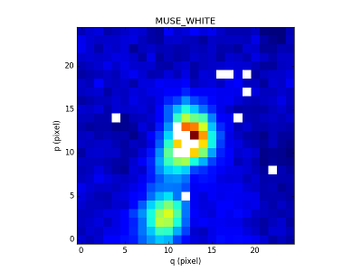
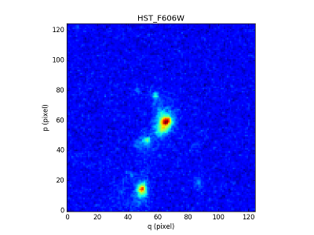

*************
Source object
*************

A lot of tools are currently been developed to detect sources in MUSE data
cubes.  In order to easily exchange information about detected sources, we
needed to define a format for storing source file.  A FITS file format has been
defined and is described in :download:`the Source ICD <_static/sources/SourceICD.pdf>`.
The `~mpdaf.sdetect.Source` class implements input/output for this Source FITS file and methods
to analyse, plot and compare source objects.

.. warning:: Source class is currently under development

A `~mpdaf.sdetect.Source` object O consist of:

+-----------+---------------------------------------------------------------+
| Component | Description                                                   |
+===========+===============================================================+
| O.header  | pyfits header instance                                        |
+-----------+---------------------------------------------------------------+
| O.lines   | astropy table that contains the parameters of spectral lines. |
+-----------+---------------------------------------------------------------+
| O.z       | astropy table that contains redshift values.                  |
+-----------+---------------------------------------------------------------+
| O.mag     | astropy table that contains magnitude values.                 |
+-----------+---------------------------------------------------------------+
| O.spectra | Dictionary that contains spectra.                             |
|           | Keys give description of the spectra.                         |
|           | Values are `mpdaf.obj.Spectrum` objects                       |
+-----------+---------------------------------------------------------------+
| O.images  | Dictionary that contains images.                              |
|           | Keys gives filter names.                                      |
|           | Values are `mpdaf.obj.Image` object                           |
+-----------+---------------------------------------------------------------+
| O.cubes   | Dictionary that contains small data cubes.                    |
|           | Keys give description of the cubes.                           |
|           | Values are `mpdaf.obj.Cube` object                            |
+-----------+---------------------------------------------------------------+
| O.tables  | Dictionary that contains astropy tables.                      |
|           | Keys give description of the tables.                          |
|           | Values are astropy table objects.                             |
+-----------+---------------------------------------------------------------+

Create a source
===============

First, we create a source object from spatial coordinates (by using `~mpdaf.sdetect.Source.from_data`):

.. ipython::

  In [1]: from mpdaf.sdetect import Source

  In [2]: s = Source.from_data(ID=36, ra=338.2260, dec=-60.5640, origin=('test','v0.0','DATACUBE-HDFS.fits', 'v1.34'))

`~mpdaf.sdetect.Source.info` print informations:

.. ipython::

  In [3]: s.info()
  
Informations have been save in the pyfits header instance but we can access and update each of them as an attribute:

.. ipython::

  In [4]: s.FROM

  In [5]: s.FROM = 'test2'
  
It is easy to add a new information that will be save as keyword in the FITS header.
For example we save the pixel coordinates::

  In [6]: from mpdaf.obj import Cube

  In [7]: cube = Cube('DATACUBE-HDFS-1.34.fits')

  In [8]: s.y, s.x = cube.wcs.sky2pix((s.dec,s.ra))[0]
  
Nevertheless, the special methods `~mpdaf.sdetect.Source.add_comment` and `~mpdaf.sdetect.Source.add_history` are recommended to save comment and history with the good syntax.
  
Now, we use the method `~mpdaf.sdetect.Source.add_cube` to extract and save in the Source object a subcube of 5 arcseconds centered on the source center and for the 5000:8500 Angstroem range::

  In [9]: s.add_cube(cube, 'MUSE', size=5, lbda=(5000,8500))

`~mpdaf.sdetect.Source.add_white_image` method computes from the MUSE data cube a white image of 5 arcseconds around the object and appends it to the images dictionary::

  In [10]: s.add_white_image(cube=cube, size=5)

  In [11]: s.images['MUSE_WHITE'].plot(title='MUSE_WHITE')
  Out[11]: <matplotlib.image.AxesImage at 0x7f66cdcee590>
  

`~mpdaf.sdetect.Source.add_image` extracts an image centered on the source center and appends it to the images dictionary.
We can for example extract an HST image centered on the source center and append it to the images dictionary::

  In [12]: from mpdaf.obj import Image

  In [13]: ima_hst = Image('f606_comb.fits')

  In [14]: s.add_image(ima_hst, name='HST_F606W')
  

If the parameter size is not present, the size of the image is by default the same as the white image (in arcsec).

In the same way:

 - `~mpdaf.sdetect.Source.add_narrow_band_images` creates narrow band images from a redshift value and a catalog of lines.
 - `~mpdaf.sdetect.Source.add_narrow_band_image_lbdaobs` creates a narrow band image around an observed wavelength value.
 
At the end our Source looks like that::

  In [15]: s.info()
  [INFO] FROM    = 'test2   '           / detection software                             
  [INFO] CUBE    = 'DATACUBE-HDFS.fits' / MUSE data cube                                 
  [INFO] RA      =              338.226 / RA u.degree %.7f                               
  [INFO] FROM  _V= 'v0.0    '           / version of the detection software              
  [INFO] Y       =    157.6590537314896                                                  
  [INFO] X       =     209.926327090741                                                  
  [INFO] DEC     =              -60.564 / DEC u.degree %.7f                              
  [INFO] ID      =                   36 / object ID u.unitless %d                        

  [INFO] images['HST_F606W'], 125 X 125 .data  rot=-0.5 deg
  [INFO] images['MUSE_WHITE'], 25 X 25 .data .var rot=-0.0 deg
  [INFO] cubes['MUSE'], 2801 X 25 X 25 .data .var rot=-0.0 deg
 
We can now `~mpdaf.sdetect.Source.write` the Source object in a FITS file and load it latter by using `~mpdaf.sdetect.Source.from_file`::
 
  In [16]: s.write('source%04d.fits'%s.id)
  
Extract spectra
===============

In this part, we will runs sextractor on the narrow-band images to define spectrum extraction apertures.
This algorithm has been developed by Jarle Brinchmann (University of Leiden) and ported to python as the following methods:
  
`~mpdaf.sdetect.Source.add_seg_images` runs SExtractor to create segmentation maps,

`~mpdaf.sdetect.Source.find_sky_mask` creates a sky mask from the list of segmentation maps,

`~mpdaf.sdetect.Source.find_union_mask` creates an object mask as the union of the segmentation maps,

`~mpdaf.sdetect.Source.find_intersection_mask` creates an object mask as the intersection of the segmentation maps,

`~mpdaf.sdetect.Source.extract_spectra` computes spectra from the MUSE data cube as the sum of the subcube weighted by differents masks of the object.

Add lines and estimate the best redshift
========================================

`~mpdaf.sdetect.Source.add_line` adds a line to the lines table.

`~mpdaf.sdetect.Source.sort_lines` sorts the lines by flux in descending order.

`~mpdaf.sdetect.Source.crack_z` estimates the best redshift matching the list of emission lines.

`~mpdaf.sdetect.Source.add_z` adds a redshift value to the z table.

`~mpdaf.sdetect.Source.add_mag` adds a magnitude value to the mag table.

SourceList class
================

SourceList is a sub-class of the python list class.  This class contains just
one method `mpdaf.sdetect.SourceList.write
<mpdaf.sdetect.SourceList.write>` that creates a folder and saves all sources
files and the catalog file in it.
