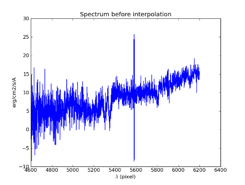

***************
Spectrum object
***************

The Spectrum object handles a 1D data array (basically a numpy masked array)
containing flux values, associated with a `WaveCoord <mpdaf.obj.WaveCoord>`
object containing the wavelength information. Optionally, a variance data array
can be attached and used for weighting the flux values. Array masking is used
to ignore some of the pixel values in the calculations.

Note that virtually all numpy and scipy functions are available.

Examples::

  import numpy as np
  from mpdaf.obj import Spectrum
  from mpdaf.obj import WaveCoord

  spe = Spectrum(filename="spectrum.fits",ext=1) # spectrum from file (extension number is 1)

  wave1 = WaveCoord(cdelt=1.25, crval=4000.0, cunit='Angstrom')
  wave2 = WaveCoord(cdelt=1.25, crval=4000.0, cunit='Angstrom', shape=3000)
  MyData = np.ones(4000)

  spe = Spectrum(wave=wave1, data=MyData) # spectrum filled with MyData
  spe = Spectrum(wave=wave2, data=MyData) # warning: wavelength coordinates and data have not the same dimensions. Shape of WaveCoord object is modified.
  # Shape of WaveCoord object is modified.
  # spe.wave = 4000

Spectrum object format
======================

A Spectrum object O consists of:

+------------------+------------------------------------------------------------------------+
| Component        | Description                                                            |
+==================+========================================================================+
| O.filename       | Possible FITS filename                                                 |
+------------------+------------------------------------------------------------------------+
| O.primary_header | FITS primary header instance                                           |
+------------------+------------------------------------------------------------------------+
| O.wave           | World coordinate spectral information  (`~mpdaf.obj.WaveCoord` object) |
+------------------+------------------------------------------------------------------------+
| O.shape          | Array containing the dimension nk                                      |
+------------------+------------------------------------------------------------------------+
| O.data           | Masked numpy array with data values                                    |
+------------------+------------------------------------------------------------------------+
| O.data_header    | FITS data header instance                                              |
+------------------+------------------------------------------------------------------------+
| O.unit           | Physical units of the data values                                      |
+------------------+------------------------------------------------------------------------+
| O.dtype          | Type of the data (integer, float)                                      |
+------------------+------------------------------------------------------------------------+
| O.var            | (optionally) Numpy array with variance values                          |
+------------------+------------------------------------------------------------------------+

Reference
=========

`mpdaf.obj.Spectrum <mpdaf.obj.Spectrum>` is the Spectrum constructor.

`mpdaf.obj.Spectrum.copy <mpdaf.obj.DataArray.copy>` returns a new copy of a Spectrum object.

`mpdaf.obj.Spectrum.clone <mpdaf.obj.DataArray.clone>` returns a new spectrum of the same shape and coordinates, filled with zeros.

`mpdaf.obj.Spectrum.info <mpdaf.obj.DataArray.info>` prints information.

`mpdaf.obj.Spectrum.write <mpdaf.obj.Spectrum.write>` saves the Spectrum object in a FITS file.

`mpdaf.obj.Spectrum.peak_detection <mpdaf.obj.Spectrum.peak_detection>` returns a list of peak locations.

Indexing
--------

`Spectrum[k] <mpdaf.obj.Spectrum.__getitem__>` returns the corresponding value of pixel k.

`Spectrum[k1:k2] <mpdaf.obj.Spectrum.__getitem__>` returns the sub-spectrum between pixels k1 and k2

`Spectrum[k] = value <mpdaf.obj.Spectrum.__setitem__>` sets the value of Spectrum.data[k]

`Spectrum[k1:k2] = array <mpdaf.obj.Spectrum.__setitem__>` sets the values in the corresponding part of Spectrum.data.

Getters and setters
-------------------

`mpdaf.obj.Spectrum.get_lambda <mpdaf.obj.Spectrum.get_lambda>` returns the flux value corresponding to a wavelength, or returns the sub-spectrum corresponding to a wavelength range.

`mpdaf.obj.Spectrum.get_step <mpdaf.obj.Spectrum.get_step>` returns the wavelength step.

`mpdaf.obj.Spectrum.get_start <mpdaf.obj.Spectrum.get_start>` returns the wavelength value of the first pixel.

`mpdaf.obj.Spectrum.get_end <mpdaf.obj.Spectrum.get_end>` returns the wavelength value of the last pixel.

`mpdaf.obj.Spectrum.get_range <mpdaf.obj.Spectrum.get_range>` returns the wavelength range [Lambda_min,Lambda_max]

`mpdaf.obj.Spectrum.get_data_hdu <mpdaf.obj.Spectrum.get_data_hdu>` returns astropy.io.fits.ImageHDU corresponding to the DATA extension.

`mpdaf.obj.Spectrum.get_stat_hdu <mpdaf.obj.Spectrum.get_stat_hdu>` returns astropy.io.fits.ImageHDU corresponding to the STAT extension.

`mpdaf.obj.Spectrum.set_wcs <mpdaf.obj.Spectrum.set_wcs>` sets the world coordinates.

Mask
----

`<= <mpdaf.obj.DataArray.__le__>` masks data array where greater than a given value.

`< <mpdaf.obj.DataArray.__lt__>` masks data array where greater or equal than a given value.

`>= <mpdaf.obj.DataArray.__ge__>` masks data array where less than a given value.

`> <mpdaf.obj.DataArray.__gt__>` masks data array where less or equal than a given value.

`mpdaf.obj.Spectrum.mask <mpdaf.obj.Spectrum.mask>` masks the spectrum (in place).

`mpdaf.obj.Spectrum.unmask <mpdaf.obj.DataArray.unmask>` unmasks the spectrum (in place).

`mpdaf.obj.Spectrum.mask_variance <mpdaf.obj.DataArray.mask_variance>` masks pixels with a variance upper than threshold value (in place).

`mpdaf.obj.Spectrum.interp_mask <mpdaf.obj.Spectrum.interp_mask>` interpolates masked pixels (in place).

`mpdaf.obj.Spectrum.mask_selection <mpdaf.obj.DataArray.mask_selection>` masks pixels corresponding to a selection.

Arithmetic
----------

`\+ <mpdaf.obj.Spectrum.__add__>` makes a addition.

`\- <mpdaf.obj.Spectrum.__sub__>` makes a substraction .

`\* <mpdaf.obj.Spectrum.__mul__>` makes a multiplication.

`/ <mpdaf.obj.Spectrum.__div__>` makes a division.

`mpdaf.obj.Spectrum.mean <mpdaf.obj.Spectrum.mean>` computes the mean flux value over a wavelength range.

`mpdaf.obj.Spectrum.sum <mpdaf.obj.Spectrum.sum>` computes the total flux value over a wavelength range.

`mpdaf.obj.Spectrum.sqrt <mpdaf.obj.DataArray.sqrt>` computes the positive square-root of data extension.

`mpdaf.obj.Spectrum.abs <mpdaf.obj.DataArray.abs>` computes the absolute value of data extension.

`mpdaf.obj.Spectrum.integrate <mpdaf.obj.Spectrum.integrate>` integrates the flux value over a wavelength range.

Transformation
--------------

`mpdaf.obj.Spectrum.resize <mpdaf.obj.Spectrum.resize>` resizes the spectrum to have a minimum number of masked values (in place).

`mpdaf.obj.Spectrum.rebin_mean <mpdaf.obj.Spectrum.rebin_mean>` shrinks the size of the spectrum by factor (mean values used).

`mpdaf.obj.Spectrum.rebin_median <mpdaf.obj.Spectrum.rebin_median>` shrinks the size of the spectrum by factor (median values used).

`mpdaf.obj.Spectrum.resample <mpdaf.obj.Spectrum.resample>` resamples spectrum to different wavelength step size.

`mpdaf.obj.Spectrum.truncate <mpdaf.obj.Spectrum.truncate>` truncates a spectrum (in place).

`mpdaf.obj.Spectrum.median_filter <mpdaf.obj.Spectrum.median_filter>` performs a median filter on the spectrum.

`mpdaf.obj.Spectrum.convolve <mpdaf.obj.Spectrum.convolve>` convolves the spectrum with a other spectrum or an array.

`mpdaf.obj.Spectrum.fftconvolve <mpdaf.obj.Spectrum.fftconvolve>` convolves the spectrum with a other spectrum or an array using fft.

`mpdaf.obj.Spectrum.correlate <mpdaf.obj.Spectrum.correlate>` cross-correlates the spectrum with a other spectrum or an array.

`mpdaf.obj.Spectrum.fftconvolve_gauss <mpdaf.obj.Spectrum.fftconvolve_gauss>` convolves the spectrum with a Gaussian using fft.

`mpdaf.obj.Spectrum.LSF_convolve <mpdaf.obj.Spectrum.LSF_convolve>` convolves the spectrum with an LSF.

Fit
---

`mpdaf.obj.Spectrum.poly_fit <mpdaf.obj.Spectrum.poly_fit>` returns coefficients of the polynomial fit on spectrum.

`mpdaf.obj.Spectrum.poly_val <mpdaf.obj.Spectrum.poly_val>` updates in place the spectrum data from polynomial fit coefficients.

`mpdaf.obj.Spectrum.poly_spec <mpdaf.obj.Spectrum.poly_spec>` performs polynomial fit on spectrum.

`mpdaf.obj.Spectrum.fwhm <mpdaf.obj.Spectrum.fwhm>` returns the fwhm of a peak.

`mpdaf.obj.Spectrum.gauss_fit <mpdaf.obj.Spectrum.gauss_fit>` performs Gaussian fit on spectrum.

`mpdaf.obj.Spectrum.add_gaussian <mpdaf.obj.Spectrum.add_gaussian>` adds a Gaussian on spectrum (in place).

`mpdaf.obj.Spectrum.gauss_dfit <mpdaf.obj.Spectrum.gauss_dfit>` performs a double Gaussian fit on spectrum.

`mpdaf.obj.Spectrum.gauss_asymfit <mpdaf.obj.Spectrum.gauss_asymfit>` performs an asymetric Gaussian fit on spectrum.

`mpdaf.obj.Spectrum.add_asym_gaussian <mpdaf.obj.Spectrum.add_asym_gaussian>` adds an asymetric Gaussian on spectrum (in place).

`mpdaf.obj.Spectrum.line_gauss_fit <mpdaf.obj.Spectrum.line_gauss_fit>` performs Gaussian fit on a line (fixed Gaussian center).

Photometry
----------

`mpdaf.obj.Spectrum.abmag_band <mpdaf.obj.Spectrum.abmag_band>` computes AB magnitude corresponding to the wavelength band.

`mpdaf.obj.Spectrum.abmag_filter_name <mpdaf.obj.Spectrum.abmag_filter_name>` computes AB magnitude using the filter name.

`mpdaf.obj.Spectrum.abmag_filter <mpdaf.obj.Spectrum.abmag_filter>` computes AB magnitude using array filter.

Plotting
--------

`mpdaf.obj.Spectrum.plot <mpdaf.obj.Spectrum.plot>` plots the spectrum.

`mpdaf.obj.Spectrum.log_plot <mpdaf.obj.Spectrum.log_plot>` plots the spectrum with a logarithmic scale on the y-axis.

Tutorial
========

We can load the tutorial files with the command::

 > git clone http://urania1.univ-lyon1.fr/git/mpdaf_data.git

Preliminary imports for all tutorials::

  >>> import numpy as np
  >>> import matplotlib.pyplot as plt
  >>> import astropy.units as u
  >>> from mpdaf.obj import Spectrum
  >>> from mpdaf.obj.coords import WaveCoord

Tutorial 1: Spectrum Creation
-----------------------------

A Spectrum object is created:

- either from one or two numpy data arrays (containing flux values and variance), using the following command::

  >>> MyData=np.ones(4000) # numpy data array
  >>> MyVariance=np.ones(4000) # numpy variance array
  >>> spe = Spectrum(data=MyData) # spectrum filled with MyData
  >>> spe = Spectrum(data=MyData,var=MyVariance) # spectrum filled with MyData and MyVariance

- or from a FITS file (in which case the flux and variance values are read from specific extensions), using the following commands::

  >>> spe = Spectrum(filename="spectrum.fits",ext=1) # data array is read from the file (extension number 1)
  >>> spe = Spectrum(filename="spectrum.fits",ext=[1,2]) # data and variance arrays read from the file (extension numbers 1 and 2)

If the FITS file contains a single extension (spectrum fluxes), or when the FITS extension are specifically named 'DATA' (for flux values) and 'STAT' (for variance  values), the keyword "ext=" is unnecessary.

The `WaveCoord <mpdaf.obj.WaveCoord>` object is either created using a linear scale, copied from another Spectrum, or
using the information from the FITS header::

  >>> wave1 = WaveCoord(crval=4000.0, cdelt=1.25, cunit=u.angstrom)
  >>> wave2 = spe.wave

  >>> spe2=Spectrum(data=MyData,wave=wave1)

In the first case, the wavelength solution is linear with the array index k: the first array value (k=0) corresponds to a wavelength of 4000 Angstroms, and the next array values (k=1,2 ...) are spaced by 1.25 Angstroms.

Tutorial 2: Spectrum manipulation: masking, interpolating, rebinning
--------------------------------------------------------------------

Here we describe how we can mask noisy parts in a spectrum, and do a polynomial
interpolation taking into account the variance.

We start from the original spectrum and its variance::

  >>> spvar = Spectrum('Spectrum_Variance.fits',ext=[0,1])

We mask the residuals from the strong sky emission line around 5577 Angstroms::

  >>> spvar.mask(lmin=5575, lmax=5590, unit=spvar.wave.unit)

We select (in wavelengths) the clean spectrum region we want to interpolate::

  >>> spvarcut = spvar.get_lambda(lmin=4000, lmax=6250, unit=spvar.wave.unit)

We can then choose to perform a linear interpolation of the masked values::

  >>> spvarcut.interp_mask()

The other option is to perform an interpolation with a spline::

  >>> spvarcut.interp_mask(spline=True)

The results of the interpolations are shown below::

  >>> spvar.unmask()
  >>> spvar.plot(lmin=4600, lmax=6200, title='Spectrum before interpolation', unit=spvar.wave.unit)
  >>> plt.figure()
  >>> spvarcut.plot(lmin=4600, lmax=6200, title='Spectrum after interpolation', unit=spvar.wave.unit)

.. image:: _static/spectrum/Spectrum_after_interp_mask.png

Last, we will resample the extracted spectrum using the 2 dedicated functions
(rebin_mean and resample).  The function `rebin_mean
<mpdaf.obj.Spectrum.rebin_mean>` rebins the Spectrum using an integer number of
pixels per bin. The corresponding variance is updated accordingly. We can
overplot the rebinned Spectrum and show the corresponding variance as follows::

  >>> plt.figure()
  >>> sprebin1 = spvarcut.rebin_mean(5)
  >>> spvarcut.plot()
  >>> (sprebin1+10).plot(noise=True)

.. figure:: _static/spectrum/Spectrum_rebin.png
  :align:   center

The function `resample <mpdaf.obj.Spectrum.resample>` resamples the Spectrum
with a specific numbers of wavelength units per pixel. The Variance is not
updated::

  >>> plt.figure()
  >>> sprebin2 = spvarcut.resample(4.2, unit=spvarcut.wave.unit) # 4.2 Angstroms / pixel
  >>> spvarcut.plot()
  >>> (sprebin2+10).plot(noise=True)

.. figure:: _static/spectrum/Spectrum_rebin2.png
  :align:   center

Tutorial 3: Gaussian Line fitting
---------------------------------

We want to fit the emission lines in a z=0.6758 galaxy (Hbeta and [OIII]).
We open the spectrum and associated variance::

  >>> specline=Spectrum('Spectrum_lines.fits')

We plot the spectrum around the [OIII] line::

  >>> specline.plot(lmin=8350,lmax=8420, unit=specline.wave.unit)

We do an interactive line fitting on the plot, by selecting with the mouse the left and right
continuum (2 positions) and the peak of the line. Variance weighting is used in the fit::

  >>> specline.igauss_fit()
  Use the 2 first mouse clicks to get the wavelength range to compute the gaussian left value.
  Use the next click to get the peak wavelength.
  Use the 2 last mouse clicks to get the wavelength range to compute the gaussian rigth value.
  To quit the interactive mode, click on the right mouse button.
  The parameters of the last gaussian are saved in self.gauss.
  [INFO] Gaussian center = 8390.53 (error:0.19761)
  [INFO] Gaussian integrated flux = 667.643 (error:64.7184)
  [INFO] Gaussian peak value = 150.883 (error:2.25841)
  [INFO] Gaussian fwhm = 4.15693 (error:0.465175)
  [INFO] Gaussian continuum = 1.66598

The result of the fit is overploted in red:

.. figure:: _static/spectrum/specline1.png
  :align:   center

  Interactive Gaussian line fitting result

Now, we move to the fainter line (Hbeta) and we perform the same analysis, again using variance weighting::

  >>> specline.plot(lmin=8090,lmax=8210, unit=specline.wave.unit)
  >>> specline.gauss_fit()

The result of the fit is given below:

.. figure:: _static/spectrum/specline2.png
  :align:   center

  Interactive Gaussian line fitting on a faint line

The results from the fit can be retrieved in the `Gauss1D <mpdaf.obj.Gauss1D>` object associated
with the spectrum (self.gauss). For example we can measure the equivalent width of the line like this::

  >>> specline.gauss.flux/specline.gauss.cont
  198.618
