Cube object
***********

.. warning::

   Draft version, still incomplete

Cube python object can handle datacubes which have a regular grid format in both spatail and spectral axis.
Variance information can also be taken into account as well as bad pixels. 
Cube object can be read and written to disk as a multi-extension FITS file.

Object is build as a set or numpy masked arrays and world coordinate information. A number of transformation
have been developed  as object properties. Note that virtually all numpy and scipy functions are available.

Cube object format
==================

A cube object O consist of:

+------------+--------------------------------------------------------+
| Component  | Description                                            |
+============+========================================================+
| O.wcs      | world coordinate spatail information                   |
+------------+--------------------------------------------------------+
| O.wave     | world coordinate spectral information                  |
+------------+--------------------------------------------------------+
| O.data     | masked numpy array with data values                    |
+------------+--------------------------------------------------------+
| O.var      | (optionally) masked numpy array with variance values   |
+------------+--------------------------------------------------------+

Each numpy masked array has 3 dimensions: Array[k,p,q] with k the spectral axis, p and q the spatial axes

Tutorials
=========

We can load the tutorial files with the command::

git clone http://urania1.univ-lyon1.fr/git/mpdaf_data.git

Tutorial 1
----------

In this tutorial we learn how to play with an existing datacube, extract a small cube centered around an object and compute its spectrum.

We read the datacube from disk and display basic information::

 >>> from mpdaf.obj import Cube
 >>> cube = Cube('Central_DATACUBE_FINAL_11to20_2012-05-16.fits')
 >>> cube.info()
 3601 X 101 X 101 cube (Central_DATACUBE_FINAL_11to20_2012-05-16.fits)
 .data(3601,101,101) (erg/s/cm**2/Angstrom) fscale=1e-20, .var(3601,101,101)
 center:(-30:00:01.35,01:20:00.137) size in arcsec:(20.200,20.200) step in arcsec:(0.200,0.200) rot:0.0
 wavelength: min:4800.00 max:9300.00 step:1.25 Angstrom

The info directive gives us already some important informations:

- The cube format 3601 X 101 X 101 has 101 x 101 spatial pixels and 3601 spectral pixels
- In addition to the data extension (.data(3601,101,101) a variance extension is also present (.var(3601,101,101))
- The flux data unit is erg/s/cm**2/Angstrom and the scale factor is 10**-20
- The center of the field of view is at DEC: -30° 0' 1.35" and RA: 1°20'0.137" and its size is 20.2x20.2 arcsec**2. The spaxel dimension is 0.2x0.2 arcsec**2. The rotation angle is 0° with respect to the North.
- The wavelength range is 4800-9300 Angstrom with a step of 1.25 Angstrom

Let's compute the reconstructed white light image and display it::

 >>> ima = cube.sum(axis=0)
 >>> ima.plot(scale='arcsinh')

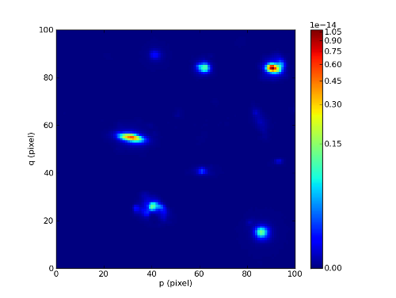

We extract the cube corresponding to the object centered at x=31 y=55 spaxels::

 >>> obj1 = cube[:,55-5:55+5,31-10:31+10]
 >>> ima1 = obj1.mean(axis=0)
 >>> ima1.plot()

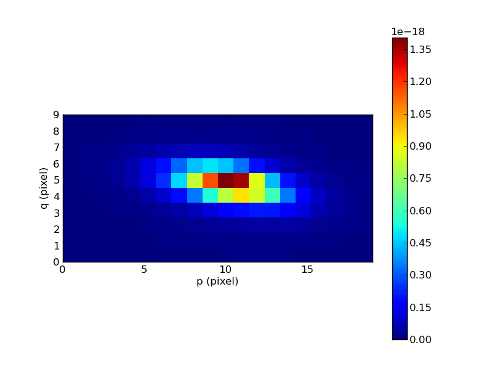

Let's now compute the total spectrum of the object::

 >>> sp1 = obj1.sum(axis=(1,2))
 >>> sp1.plot()

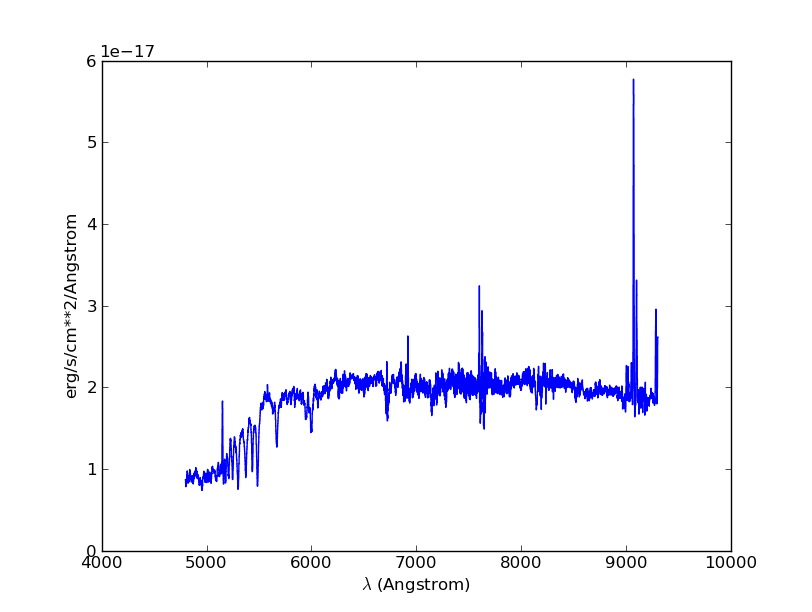

Tutorial 2
----------

In this second tutorial we create the continuum subtracted datacube of the previously extracted object.

We start by fitting the continuum on sp1 (see tutorial 1)::

 >>> cont1 = sp1.poly_spec(5)
 >>> sp1.plot()
 >>> cont1.plot(color='r')

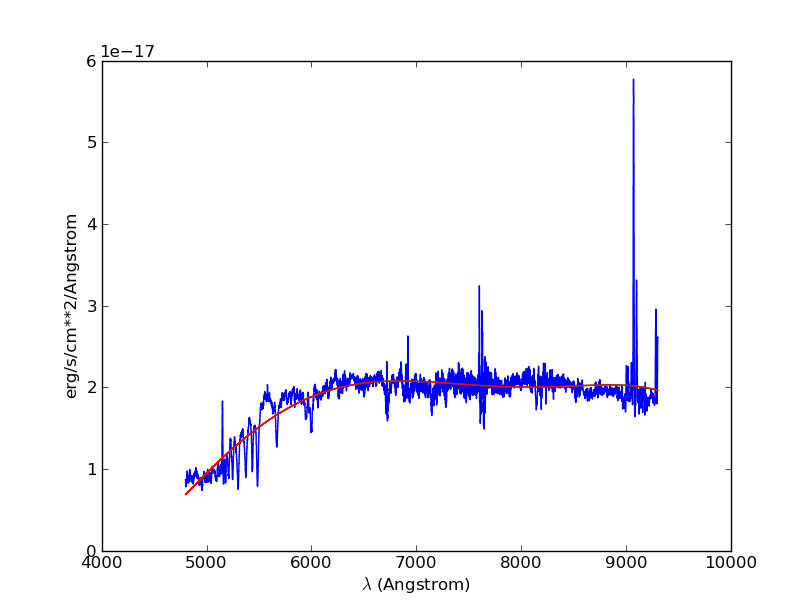

Let's try also on a single spectrum at the edge of the galaxy::

 >>> obj1[:,5,2].plot()
 >>> obj1[:,5,2].poly_spec(5).plot(color='r')

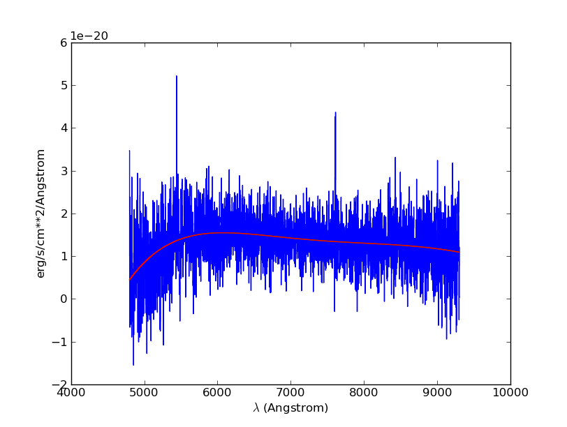

Fine, now let's do this for all spectrum of the input datacube. We are going to use the spectra iterator
to loop over all spectra.
Let's see how the spectrum iterator works::

 >>> from mpdaf.obj import iter_spe
 >>> small = obj1[:,0:2,0:3]
 >>> small.shape
 array([3601,    2,    3])
 >>> for sp in iter_spe(small):
 >>> 	print sp.data.max()
 2.06232500076
 1.98103439808
 1.90471208096
 1.92691171169
 1.94003844261
 1.57908594608

In this example, we have extracted sucessively all six spectra of the small datacube and printed their peak value.

Now let's use it to perform the computation of the continuum datacube.
We start by creating an empty datacube with the same dimensions than the original one, but without variance
information (using the clone function). Using two spectrum iterors we extract iteratively
all input spectra (sp) and (still
empty) continuum spectrum (co). For each extracted spectrum we just fit the continuum and save it to the
continuum datacube.::

 >>> cont1 = obj1.clone()
 >>> for sp,co in zip(iter_spe(obj1), iter_spe(cont1)):
 >>>   co[:] = sp.poly_spec(5)
 >>>

And that's it, we have now the continuum datacube. Note that we have used the co[:] = sp.poly_spec(5)
assignment rather than the more intuitive co = sp.poly_spec(5) assignment. The use of co[:] is mandatory
otherwise the continnum spectra co is created but not written into the cont1 datacube.

Let's check the result and display the continuum reconstructed image::

 >>> rec2 = cont1.sum(axis=0)
 >>> rec2.plot(scale='arcsinh')

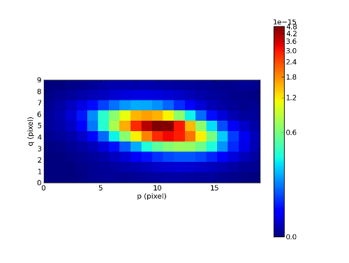

We can also compute the line emission datacube::

 >>> line1 = obj1 - cont1
 >>> line1.sum(axis=0).plot(scale='arcsinh')

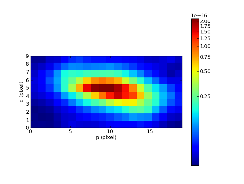

Tutorial 3
----------

In this tutorial we will compute equivalent width of the Ha emission in the galaxy.
First let's isolate the emission line by truncating the object datacube in wavelength.::

 >>> sp1.plot()
 >>> k1,k2 = sp1.wave.pixel([9000,9200], nearest=True)
 >>> emi1 = obj1[k1+1:k2+1,:,:]
 >>> emi1.info()
 160 X 10 X 20 cube (no name)
 .data(160,10,20) (erg/s/cm**2/Angstrom) fscale=1e-20, .var(160,10,20)
 center:(-30:00:00.45,01:20:00.438) size in arcsec:(2.000,4.000) step in arcsec:(0.200,0.200) rot:0.0
 wavelength: min:9001.25 max:9200.00 step:1.25 Angstrom
 >>> sp1 = emi1.sum(axis=(1,2))
 >>> sp1.plot(color='r')
 
.. figure::  user_manual_cube_images/spec4.png
   :align:   center

We first fit and subtract the continuum. Before doing the polynomial fit we mask the region of
the emission lines (sp1.mask) and then we perform the linear fit. Then the spectrum is unmasked
and the continnum subtracted::

 >>> sp1.mask(9050, 9125)
 >>> cont1 = sp1.poly_spec(1)
 >>> sp1.unmask()
 >>> cont1.plot()
 >>> line1 = sp1 - cont1
 >>> line1.plot(color='r')
 
.. figure::  user_manual_cube_images/spec5.png
   :align:   center

We then compute the Ha line total flux by simple integration (taking into account the pixel size in A)
over the wavelength range centered around Halfa and the continuum mean flux at the same location::

 >>> k = line1.data.argmax()
 >>> line1[55-10:55+11].plot(color='r')
 >>> fline = line1[55-10:55+11].sum()*line1.get_step()
 >>> cline = cont1[55-10:55+11].mean()
 >>> ew = fline/cline
 >>> print fline, cline, ew
 2.9053587488e-16 1.94553834915e-17 14.9334437436
 
.. figure::  user_manual_cube_images/spec6.png
   :align:   center

Now we repeat this for all datacube spectra, and we  save Ha flux and equivalent width in two images.
We start creating two images with identical shape and wcs as the reconstructed image and then use
the spectrum iterator.::

 >>> ha_flux = ima1.clone()
 >>> cont_flux = ima1.clone()
 >>> ha_ew = ima1.clone()
 >>> for sp,pos in iter_spe(emi1, index=True):
 >>>   p,q = pos
 >>>   sp.mask(9050, 9125)
 >>>   cont = sp.poly_spec(1)
 >>>   sp.unmask()
 >>>   line = sp - cont
 >>>   fline = line[55-10:55+11].sum()*line.get_step()
 >>>   cline = cont[55-10:55+11].mean()
 >>>   ew = fline/cline
 >>>   cont_flux[p,q] = cline
 >>>   ha_flux[p,q] = fline
 >>>   ha_ew[p,q] = ew
 >>> cont_flux.plot(title="continuum mean flux")
 >>> ha_flux.plot(title="Ha line total flux")
 >>> import numpy as np
 >>> ha_ew.mask_selection(np.where(ima1.data<0.5))
 >>> # ha_ew.plot(vmin=-15,vmax=15)
 >>> ha_ew.plot(title="Ha line ew")
 
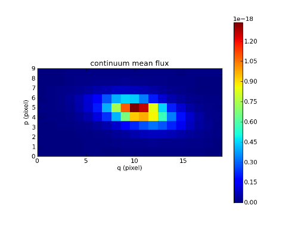
   
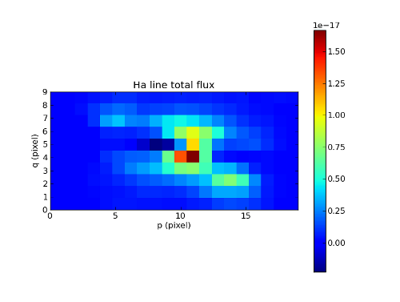

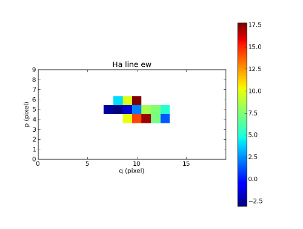

Tutorial 4
----------

In this tutorial we are going to process our datacube in spatial direction. We consider the datacube as a collection of
monochromatic images and we process each of them. For each monochromatic image we apply a convolution by a gaussian kernel::

 >>> from mpdaf.obj import iter_ima
 >>> cube2 = cube.clone()
 >>> for ima,k in iter_ima(cube, index=True):
 >>>   cube2[k,:,:] = ima.gaussian_filter()
 >>> cube2.sum(axis=0).plot()
 
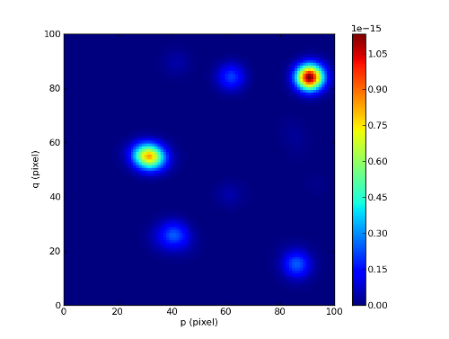

Reference
=========

:func:`mpdaf.obj.Cube <mpdaf.obj.Cube>` is the classic image constructor.

:func:`mpdaf.obj.Cube.copy <mpdaf.obj.Cube.copy>` copies Cube object in a new one and returns it.

:func:`mpdaf.obj.Cube.clone <mpdaf.obj.Cube.clone>` returns a new cube of the same shape and coordinates, filled with zeros.

:func:`mpdaf.obj.Cube.info <mpdaf.obj.Cube.info>` prints information.

:func:`mpdaf.obj.Cube.write <mpdaf.obj.Cube.write>` saves the Cube in a FITS file.

Indexing
--------

:func:`Cube[k,p,q] <mpdaf.obj.Cube.__getitem__>` returns the corresponding value.

:func:`Cube[k1:k2,p1:p2,q1:q2] <mpdaf.obj.Cube.__getitem__>` returns the sub-cube.

:func:`Cube[k,:,:] <mpdaf.obj.Cube.__getitem__>` returns an Image.

:func:`Cube[:,p,q] <mpdaf.obj.Cube.__getitem__>` returns a Spectrum.

:func:`Cube[k,p,q] = value <mpdaf.obj.Cube.__setitem__>` sets value in Cube.data[k,p,q]

:func:`Cube[k1:k2,p1:p2,q1:q2] = array <mpdaf.obj.Cube.__setitem__>` sets the corresponding part of Cube.data.

Getters and setters
-------------------

:func:`mpdaf.obj.Cube.get_lambda <mpdaf.obj.Cube.get_lambda>` returns the sub-cube corresponding to a wavelength range.

:func:`mpdaf.obj.Cube.get_step <mpdaf.obj.Cube.get_step>` returns the cube steps.

:func:`mpdaf.obj.Cube.get_range <mpdaf.obj.Cube.get_range>` returns minimum and maximum values of cube coordiantes.

:func:`mpdaf.obj.Cube.get_start <mpdaf.obj.Cube.get_start>` returns coordinates values corresponding to pixel (0,0,0).

:func:`mpdaf.obj.Cube.get_end <mpdaf.obj.Cube.get_end>` returns coordinates values corresponding to pixel (-1,-1,-1).

:func:`mpdaf.obj.Cube.get_rot <mpdaf.obj.Cube.get_rot>` returns the rotation angle.

:func:`mpdaf.obj.Cube.set_wcs <mpdaf.obj.Cube.set_wcs>` sets the world coordinates.

:func:`mpdaf.obj.Cube.set_var <mpdaf.obj.Cube.set_var>` sets the variance array.

Mask
----

:func:`<= <mpdaf.obj.Cube.__le__>` masks data array where greater than a given value.                                 

:func:`< <mpdaf.obj.Cube.__lt__>` masks data array where greater or equal than a given value. 

:func:`>= <mpdaf.obj.Cube.__ge__>` masks data array where less than a given value.

:func:`> <mpdaf.obj.Cube.__gt__>` masks data array where less or equal than a given value.

:func:`mpdaf.obj.Cube.unmask <mpdaf.obj.Cube.unmask>` unmasks the cube (just invalid data (nan,inf) are masked) (in place).

:func:`mpdaf.obj.Cube.mask_variance <mpdaf.obj.Cube.mask_variance>` masks pixels with a variance upper than threshold value.

:func:`mpdaf.obj.Cube.mask_selection <mpdaf.obj.Cube.mask_selection>` masks pixels corresponding to a selection.

Arithmetic
----------

:func:`\+ <mpdaf.obj.Cube.__add__>` makes a addition.

:func:`\- <mpdaf.obj.Cube.__sub__>` makes a substraction .

:func:`\* <mpdaf.obj.Cube.__mul__>` makes a multiplication.

:func:`/ <mpdaf.obj.Cube.__div__>` makes a division.

:func:`\*\* <mpdaf.obj.Cube.__pow__>`  computes the power exponent of data extensions.

:func:`mpdaf.obj.Cube.sqrt <mpdaf.obj.Cube.sqrt>` computes the positive square-root of data extension.

:func:`mpdaf.obj.Cube.abs <mpdaf.obj.Cube.abs>` computes the absolute value of data extension.

:func:`mpdaf.obj.Cube.sum <mpdaf.obj.Cube.sum>` returns the sum over the given axis.

:func:`mpdaf.obj.Cube.mean <mpdaf.obj.Cube.mean>` returns the mean over the given axis.

Transformation
--------------

:func:`mpdaf.obj.Cube.resize <mpdaf.obj.Cube.resize>` resizes the cube to have a minimum number of masked values (in place).

